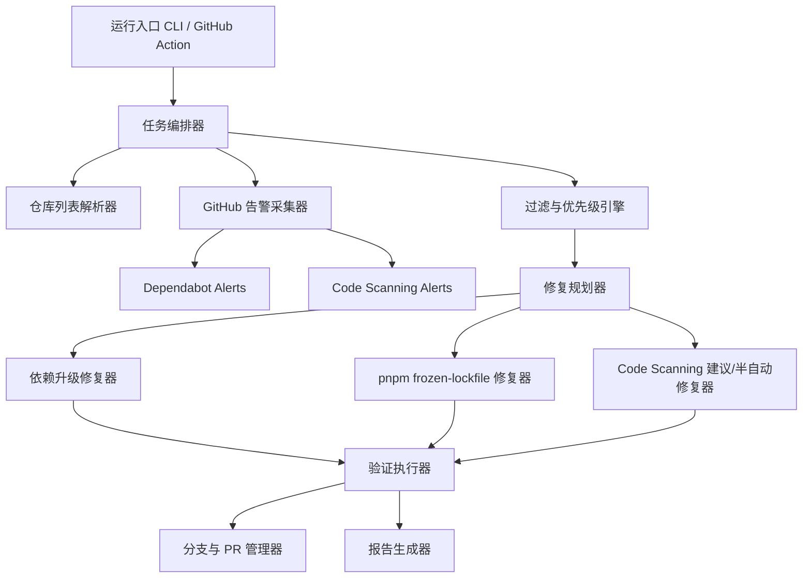

# dependfix 项目设计方案

## 1. 文档定位

- 文档类型：设计方案 / 实施规划文档。
- 目标读者：项目维护者、后续实现角色、工作流与自动化平台维护者。
- 文档目的：把“自动化修复 GitHub Security 告警”的想法收敛为可实现的产品目标、模块边界、执行流程、配置模型、验收标准与分阶段交付计划。

## 2. 当前事实

基于当前仓库已有内容，可以确认以下事实：

- 仓库当前仍接近 TypeScript 模板起点，业务实现尚未落地，源码只有最小示例入口。
- 项目运行环境为 Node.js >= 20，包管理器实际以 pnpm 为主，已有 `pnpm-lock.yaml`。
- 当前 CI 工作流已存在 `test.yml` 与 `release.yml`，都执行了 `pnpm i --frozen-lockfile`。
- 当前 CI 中 Node 版本使用 `lts/*`，pnpm 使用 `latest`，存在工具链漂移导致锁文件校验失败的风险。
- 仓库已启用 Dependabot 配置，但仅负责发现与升级 PR，不负责统一汇总 security 告警、策略过滤、自动修复和报告输出。
- 仓库当前没有面向该方案的专用 agent、专用技能组、告警采集模块、自动修复引擎和报告模块。

## 3. 问题定义

项目需要提供一套可直接运行、也可在 GitHub Actions 中运行的自动化方案，用于：

- 自动获取 Dependabot alerts。
- 自动获取 Code Scanning alerts。
- 按问题级别过滤待处理问题。
- 自动执行可控修复。
- 自动修复 `pnpm i --frozen-lockfile` 类错误。
- **自动处理 Dependabot 版本更新后的不兼容问题（breaking changes），通过 AI 研判提供修复方案，通过 Pull Request 提交，默认不自动合并。**
- **支持作为 GitHub Action 引入（开源项目），用户可自定义 AI API Token，具备 Prompt 注入防护。**
- **支持作为独立平台部署（闭源项目），提供权限控制、任务队列和批量处理能力。**
- 支持手动指定或自动发现要处理的仓库列表。
- 输出可归档、可审计的执行报告。

该方案的核心价值不是“把所有安全问题都自动改掉”，而是建立一条稳定的、安全边界清晰的自动修复流水线，把适合自动化的问题高效闭环，把不适合自动化的问题分类上报。

## 4. 目标与非目标

### 4.1 目标

1. 为本项目设计一个专用 agent，用于端到端编排告警拉取、过滤、修复、验证、报告与提交。
2. 为该 agent 配置一组专用技能，使问题处理流程可拆分、可复用、可扩展。
3. 支持两类安全数据源：Dependabot alerts 与 GitHub Code Scanning alerts。
4. 支持按严重级别、生态、仓库范围、规则类型进行过滤。
5. 对依赖升级类问题优先执行自动修复，并补充最小验证。
6. 对 `pnpm i --frozen-lockfile` 失败提供专门修复链路，提升自动化更新成功率。
7. **对 Dependabot 版本更新后的不兼容问题（breaking changes），通过 AI 研判自动提供修复方案（代码改动 / 版本锁定 / 其他）。**
8. 支持本地直接运行和 GitHub Actions 定时/手动运行两种执行方式。
9. **在 GitHub Action 模式下，支持用户自定义 AI API Token，内置 Prompt 注入防护。**
10. **支持作为独立平台部署，提供 Git 仓库联动、权限控制、任务队列、批量处理能力。**
11. 支持输出 Markdown/JSON 双格式报告，便于人读与机器消费。

### 4.2 非目标

1. 不承诺自动修复所有 Code Scanning 问题。复杂业务逻辑缺陷仅做分类、定位和建议。
2. 不直接替代 Dependabot 原生升级 PR，而是作为"告警聚合 + 修复编排层"增强其能力。
3. 不把高风险破坏性升级默认自动合并。默认只自动提交修复分支或 PR。
4. 不在首期支持所有语言生态。首期优先 Node.js / pnpm 仓库。
5. AI 生成的代码修复不保证 100% 正确，每个修复 PR 都需要人类审核。

## 5. 关键约束

### 5.1 业务约束

- 自动修复必须可审计，所有操作需要留下仓库、告警、修复动作、验证结果和失败原因。
- 严重级别过滤必须贯穿采集、修复、报告全链路，不能只在展示层过滤。
- 针对多仓库场景，必须支持限流、失败隔离和部分成功。

### 5.2 平台约束

- GitHub API 调用需兼容组织级多仓库场景。
- GitHub Actions 运行时需控制权限范围，最小化使用 `contents`, `pull-requests`, `security-events`, `actions`, `metadata` 等权限。
- 本地运行与 CI 运行应共用同一套核心逻辑，避免实现分叉。

### 5.3 工具链约束

- 锁文件修复逻辑必须绑定确定的 Node 与 pnpm 版本，避免 `pnpm latest` 与 `lts/*` 导致结果不稳定。
- 修复动作前后都应支持最小质量门，例如安装、构建、测试或定制命令。

## 6. 总体方案概览

方案采用“统一编排器 + 告警采集器 + 修复执行器 + 报告器”的分层设计。



## 7. 专用 Agent 设计

建议新增一个专用 agent：`Auto Fix GitHub Security Maintainer`

### 7.1 角色定位

该 agent 负责安全告警自动修复的任务编排，不直接承担所有修复细节，而是：

- 拉取并统一标准化 GitHub 安全告警。
- 根据配置决定要处理哪些仓库、哪些告警、哪些修复策略。
- 调用对应技能完成采集、过滤、修复、验证和报告。
- 在失败时给出结构化原因，而不是静默跳过。

### 7.2 输入

- GitHub Token / GitHub App 凭证。
- 目标仓库列表，或自动发现参数。
- 修复策略配置。
- 严重级别过滤规则。
- 运行模式：`local`、`ci`、`report-only`、`fix`。

### 7.3 输出

- 每个仓库的执行结果。
- 已修复告警列表。
- 未修复告警列表及原因。
- 创建的分支、提交、PR、评论链接。
- Markdown 报告与 JSON 报告。

### 7.4 决策原则

- 默认先修复高收益、低风险问题。
- 默认优先修复依赖问题，其次修复 lockfile 问题，最后处理可模板化的 code scanning 问题。
- 当验证失败、升级跨度过大或需要业务判断时，停止自动提交，仅输出建议。

## 8. 专用技能组设计

建议围绕该 agent 建立以下技能组。这里的“技能”指可独立测试、独立复用的任务能力单元，而不是把全部逻辑塞进一个大流程里。

### 8.1 `repo-selector`

职责：解析待处理仓库列表。

支持来源：

- 手动传入单仓库或多仓库列表。
- 读取配置文件中的静态仓库清单。
- 基于组织、topic、默认分支、语言、归档状态自动发现仓库。

### 8.2 `security-alert-fetcher`

职责：统一拉取安全告警并转换为内部标准模型。

覆盖：

- Dependabot alerts。
- Code Scanning alerts。

### 8.3 `alert-filter-engine`

职责：按规则过滤与排序告警。

支持维度：

- 严重级别：`critical`、`high`、`medium`、`low`。
- Code Scanning 严重级别：`error`、`warning`、`note`。
- 生态：npm / github-actions / 其他。
- 告警状态：open / fixed / dismissed。
- 是否存在明确自动修复策略。

### 8.4 `dependency-fixer`

职责：处理 Dependabot 类依赖漏洞。

能力：

- 识别受影响包、可升级版本和建议版本范围。
- 在隔离分支中更新 `package.json` 与 `pnpm-lock.yaml`。
- 支持 `pnpm up --latest`、定向升级、锁文件重建等策略。

### 8.5 `pnpm-lockfile-repair`

职责：处理 `pnpm i --frozen-lockfile` 失败。

适用场景：

- `package.json` 与 `pnpm-lock.yaml` 不一致。
- pnpm 版本差异导致 lockfile format 变更。
- 间接依赖解析结果更新但未提交 lockfile。

建议修复策略：

1. 读取仓库声明的 Node 与 pnpm 版本，如果缺失则使用平台默认配置。
2. 使用固定版本工具链执行安装或 `pnpm install --lockfile-only`。
3. 检测 lockfile 是否仅发生预期变更。
4. 重新执行 `pnpm i --frozen-lockfile` 验证修复结果。
5. 必要时补充 `pnpm dedupe` 或定向升级。

需要明确的失败分类：

- 凭证/私有源问题。
- 引擎版本不兼容。
- 依赖冲突不可解。
- 上游包已删除或解析失败。

### 8.6 `code-scanning-remediator`

职责：对 code scanning 问题做规则分类。

策略分层：

- A 类：可模板化自动修复，例如简单依赖升级、已知配置错误、GitHub Actions 版本升级。
- B 类：可生成补丁建议，但需人工确认。
- C 类：仅输出定位、证据和修复建议，不自动改代码。

### 8.7 `verification-runner`

职责：在修复后执行最小验证。

建议验证顺序：

1. 安装。
2. 类型检查或 lint。
3. 构建。
4. 仓库自定义测试命令。

### 8.8 `report-generator`

职责：输出结构化报告。

格式：

- Markdown：给人看。
- JSON：给自动化系统消费。

## 9. 功能模块设计

建议将系统拆为以下模块：

### 9.1 入口层

- CLI 入口。
- GitHub Action 入口。
- 统一参数解析器。

### 9.2 配置层

- 环境变量加载。
- 仓库级配置读取。
- 默认策略合并。

### 9.3 GitHub 集成层

- 认证与 API 客户端。
- 告警拉取。
- 仓库发现。
- 分支、提交、PR、评论操作。

### 9.4 核心域层

- 告警标准化模型。
- 过滤与优先级模型。
- 修复规划模型。
- 执行结果模型。

### 9.5 执行层

- 仓库克隆与工作目录管理。
- 包管理器命令执行。
- 质量门执行。
- 失败回滚与清理。

### 9.6 报告层

- 汇总统计。
- 单仓库明细。
- 告警-修复映射。
- 失败原因归类。

## 10. 仓库列表获取设计

方案必须同时支持手动指定与自动发现两种模式。

### 10.1 手动指定

适用场景：

- 小范围试运行。
- 高风险仓库人工筛选。
- 单团队灰度验证。

输入方式建议：

- CLI 参数。
- 环境变量。
- 配置文件中的显式列表。

### 10.2 自动发现

适用场景：

- 组织级批量治理。
- 周期性巡检。

筛选条件建议：

- organization / owner。
- topic。
- 默认分支。
- 是否 archived / disabled。
- 是否包含 `package.json` 或 `pnpm-lock.yaml`。

### 10.3 建议优先级

首期优先支持“手动指定 + 基于 owner 自动发现”两种能力，避免一开始把仓库发现做得过重。

## 11. 告警采集与标准化模型

内部建议统一为 `NormalizedSecurityAlert` 模型，至少包含：

- `source`: `dependabot` | `code-scanning`
- `repository`
- `defaultBranch`
- `severity`
- `packageEcosystem`
- `packageName`
- `manifestPath`
- `ruleId`
- `summary`
- `htmlUrl`
- `fixable`
- `fixStrategy`
- `recommendedVersion`

这样做的目的是让过滤、修复、报告三层不依赖 GitHub 原始返回结构。

## 12. 过滤与修复策略

### 12.1 严重级别过滤

建议提供以下过滤模式：

- `>= critical`
- `>= high`
- `>= medium`
- `all`

对 Dependabot 与 Code Scanning 需要建立统一映射：

- Dependabot：直接使用 `critical/high/medium/low`。
- Code Scanning：将 `error` 映射为高优先级，`warning` 映射为中优先级，`note` 默认为低优先级。

### 12.2 修复优先级

建议默认按以下顺序执行：

1. Critical 的依赖漏洞。
2. High 的依赖漏洞。
3. 会阻塞 CI 的 lockfile 问题。
4. 可模板化处理的 code scanning 问题。
5. 其余问题只输出建议。

### 12.3 风险控制

- 默认限制单次运行每个仓库最多处理的告警数量。
- 默认限制 major 升级数量。
- 对存在 breaking change 风险的升级，仅生成建议或独立 PR。

## 13. `pnpm i --frozen-lockfile` 自动修复设计

这是该项目必须重点覆盖的专项能力，因为当前仓库 CI 已显式依赖该步骤。

### 13.1 触发条件

- 修复依赖漏洞后安装失败。
- 单独执行验证时 `pnpm i --frozen-lockfile` 失败。
- 检测到 `package.json` 与 `pnpm-lock.yaml` 不一致。

### 13.2 专项修复流程

1. 固定 Node 与 pnpm 版本，不允许直接沿用漂移型默认值。
2. 读取并记录失败日志，识别是否属于 lockfile 漂移问题。
3. 在工作分支中执行 lockfile 修复命令。
4. 再次执行 `pnpm i --frozen-lockfile`。
5. 若通过，则进入后续 lint/build/test。
6. 若仍失败，则输出分类原因并停止自动提交。

### 13.3 推荐实现细节

- 在 GitHub Actions 中显式固定 pnpm 版本，而不是使用 `latest`。
- 在仓库配置中允许声明推荐 pnpm 版本。
- 记录 lockfile diff 摘要，避免把无关变更静默混入修复提交。
- 若需要，可支持 `packageManager` 字段作为优先版本来源。

## 14. 运行模式设计

### 14.1 本地直接运行

用途：

- 开发调试。
- 试运行单仓库修复。
- 复现 CI 中的失败场景。

建议形态：

- `report-only`：只拉取告警并生成报告。
- `fix`：执行修复但不推送。
- `fix-and-pr`：执行修复并推送分支 / 创建 PR。

### 14.2 GitHub Action 运行

用途：

- 定时批量治理。
- 手动触发巡检。
- 组织级自动修复。

触发方式建议：

- `workflow_dispatch`
- `schedule`

建议输入参数：

- owner / organization
- repositories
- severity-threshold
- mode
- max-repos
- dry-run

## 15. GitHub Action 设计建议

建议提供一个专用 workflow，例如 `security-auto-fix.yml`。

### 15.1 输入

- 手动仓库列表。
- owner / org。
- 严重级别阈值。
- 运行模式。
- 是否创建 PR。

### 15.2 权限

最小建议权限：

- `contents: write`
- `pull-requests: write`
- `security-events: read`
- `actions: read`
- `metadata: read`

### 15.3 输出

- workflow summary。
- Markdown 报告 artifact。
- JSON 报告 artifact。

## 16. 报告设计

报告必须同时满足“人类可读”和“机器可消费”。

### 16.1 Markdown 报告建议结构

- 运行元信息：时间、模式、阈值、仓库数。
- 汇总统计：扫描仓库数、命中告警数、已修复数、失败数、跳过数。
- 按仓库明细。
- 按严重级别统计。
- 按告警来源统计。
- 失败原因分类。
- 生成的 PR / 分支链接。

### 16.2 JSON 报告建议结构

- `runId`
- `startedAt` / `finishedAt`
- `config`
- `summary`
- `repositories[]`
- `alerts[]`
- `actions[]`
- `errors[]`

## 17. 安全与审计要求

- 不在日志和报告中输出明文令牌。
- 对 GitHub Token 权限进行最小化控制。
- 对自动提交与 PR 创建保留显式开关。
- 对自动修复动作保留 dry-run 模式。
- 对高风险升级保留人工确认机制。

## 18. 建议目录结构

以下为建议新增的项目结构，用于后续实现，不代表当前仓库已经存在：

```text
src/
  cli/
  config/
  core/
    alerts/
    filters/
    planner/
    report/
  github/
  fixers/
    dependency/
    pnpm/
    code-scanning/
  runners/
  utils/
.github/
  workflows/
    security-auto-fix.yml
docs/
  plan.md
```

## 19. 分阶段实施计划

### Phase 1: 最小可运行版本

目标：先跑通单仓库、Node/pnpm 生态下的告警拉取、过滤、依赖修复与报告输出。

范围：

- 支持手动指定仓库。
- 支持 Dependabot alerts 拉取。
- 支持严重级别过滤。
- 支持依赖升级修复。
- 支持 `pnpm i --frozen-lockfile` 自动修复。
- 支持本地运行与 Markdown/JSON 报告。

### Phase 2: GitHub Action 化

目标：把 Phase 1 逻辑接入 GitHub Actions。

范围：

- 支持 `workflow_dispatch`。
- 支持 artifact 报告输出。
- 支持创建分支与 PR。
- 支持 owner 级自动发现仓库。

### Phase 3: Code Scanning 扩展

目标：引入 Code Scanning 告警采集与分类处理。

范围：

- 支持 Code Scanning alerts 标准化。
- 支持规则级分类。
- 支持可模板化问题自动修复。
- 不可自动修复问题输出建议。

### Phase 4: 策略增强 + Breaking Change 研判

目标：增强多仓库治理能力，引入 AI 研判处理依赖升级不兼容问题。

范围：

- 并发控制与限流。
- 仓库白名单 / 黑名单。
- 更细粒度的升级策略。
- 报告归档与趋势统计。
- **AI 驱动的 breaking change 分析：读取 changelog，研判兼容性问题。**
- **生成修复方案（代码改动 / 版本锁定 / 其他）。**
- **创建修复 PR，默认不自动合并。**

### Phase 5: GitHub Action 增强 + 平台化

目标：完善 GitHub Action 集成体验，实现独立平台部署能力。

范围：

- **用户自定义 AI API Token 支持。**
- **Prompt 注入防护机制。**
- **独立平台 Web UI 与 REST API。**
- **Git 仓库管理与 OAuth 连接。**
- **任务队列与并发控制。**
- **RBAC 权限管理。**
- **批量多项目处理。**
- **Docker Compose / Helm Chart 部署支持。**

## 20. AI 驱动的 Breaking Change 研判

### 20.1 问题背景

Dependabot/Renovate 等工具仅做版本号升级，当依赖升级涉及 breaking changes 时：
- 升级后的包 API 签名变更导致编译/类型检查失败
- 行为变更导致运行时错误
- 上游包废弃某些功能或配置项

本项目引入 AI 研判能力，在依赖升级后自动分析兼容性问题，提供修复方案。

### 20.2 工作流程

```
依赖升级 PR → CI 失败检测 → AI 分析 changelog/migration guide
    → 研判结果分类:
        ├── 代码改动（生成修复 patch）
        ├── 锁定版本（生成版本锁定建议 + 说明）
        ├── 等待上游修复（记录原因）
        └── 需要人工介入（输出分析摘要）
    → 创建修复 PR（默认不自动合并）
```

### 20.3 AI 研判输入

- 依赖包的 changelog / release notes
- 升级前后的版本号差异
- CI 失败日志（lint、typecheck、build、test）
- 项目中受影响的代码文件及行号
- 依赖包的 migration guide（如有）

### 20.4 输出

- 问题分类与严重程度
- 修复方案建议（代码改动 / 版本锁定 / 其他）
- 若为代码改动，生成具体 patch diff
- 若为锁定版本，生成版本锁定配置与说明
- 置信度评级

---

## 21. GitHub Action 集成（开源项目）

### 21.1 设计目标

使开源项目可以通过一行 workflow 引用，一键引入本项目的自动修复能力。

```yaml
# .github/workflows/auto-fix.yml
name: Auto Fix Security & Dependencies
on:
  schedule:
    - cron: '0 8 * * 1'  # 每周一
  workflow_dispatch:
jobs:
  auto-fix:
    uses: dependfix/dependfix/.github/workflows/security-auto-fix.yml@main
    with:
      severity_threshold: high
      create_pr: true
    secrets:
      AI_API_TOKEN: ${{ secrets.AI_API_TOKEN }}
      GITHUB_TOKEN: ${{ secrets.GITHUB_TOKEN }}
```

### 21.2 用户自定义 AI API Token

- 用户提供自己的 AI API Token（支持 OpenAI、Anthropic、DeepSeek 等兼容 API）
- AI 调用完全走用户自己的账户，数据不经过项目维护方
- Token 通过 GitHub Secrets 传入，不在日志中输出

### 21.3 Prompt 注入防护

为防止恶意用户在 Issue/PR 标题或内容中注入指令，采取以下措施：

1. **触发权限限制**：只有仓库管理员（admin）可触发 AI 分析流程
   - `workflow_dispatch` 需要 write 以上权限
   - 不接受来自 Issue comment 或 PR comment 的触发命令
   - schedule 触发不依赖外部输入

2. **输入沙箱化**：
   - AI 分析输入仅包含：changelog 原文、CI 失败日志、受影响的文件 diff
   - 不接受自由文本输入
   - 对 changelog 内容做结构性校验（过滤 HTML/JS/Shell 注入标记）

3. **指令隔离**：
   - AI 的系统提示词硬编码，不接受用户自定义
   - 外部内容（changelog 等）作为 data 字段传入，与系统指令严格分离
   - 使用 OpenAI/Anthropic API 的 system/user 角色分离策略

4. **输出约束**：
   - AI 输出需通过 schema 校验（结构化 JSON），不接受自由格式输出
   - 生成的代码 patch 需经过 lint/typecheck 等质量门验证

---

## 22. 独立平台部署（闭源项目）

### 22.1 设计目标

对于无法将源码/Token 暴露到外部 GitHub Action 的闭源项目，提供独立部署的平台方案。

### 22.2 架构概览

```
┌──────────────────────────────────────────────┐
│              Auto-Fix Platform                 │
│  ┌──────────┐  ┌──────────┐  ┌───────────┐   │
│  │ Web UI   │  │ REST API │  │ CLI Tool  │   │
│  └────┬─────┘  └────┬─────┘  └─────┬─────┘   │
│       └──────────────┼──────────────┘          │
│              ┌───────┴───────┐                 │
│              │  Auth & RBAC  │                 │
│              └───────┬───────┘                 │
│  ┌───────────────────┼────────────────────┐    │
│  │  ┌────────┐  ┌────┴────┐  ┌────────┐  │    │
│  │  │ Git    │  │  Task   │  │ Report │  │    │
│  │  │ Repo   │  │  Queue  │  │ Engine │  │    │
│  │  │ Mgr    │  │  (MQ)   │  │        │  │    │
│  │  └────────┘  └────┬────┘  └────────┘  │    │
│  │  ┌────────────────┴────────────────┐   │    │
│  │  │      Fix Execution Engine       │   │    │
│  │  │  (Dependency + Code + AI Fix)   │   │    │
│  │  └─────────────────────────────────┘   │    │
│  └─────────────────────────────────────────┘   │
└──────────────────────────────────────────────┘
```

### 22.3 核心模块

#### Git 仓库管理
- 支持连接 GitHub / GitLab / Bitbucket 仓库
- 支持 Personal Access Token / OAuth App 认证
- 仓库级别配置（包管理器、忽略列表、自定义验证命令）

#### 任务队列
- 使用消息队列（如 BullMQ + Redis）管理修复任务
- 并发控制：每个仓库同一时间最多一个修复任务在执行
- 优先级队列：security alerts > dependency updates > routine checks
- 任务去重：同一仓库的重复提交在队列中合并
- 失败重试策略：指数退避，最大重试次数可配

#### 权限控制 (RBAC)
- 角色：Admin、Org Admin、Repo Admin、Viewer
- Admin：全局配置、用户管理、计费
- Org Admin：管理组织下所有仓库
- Repo Admin：管理特定仓库的修复策略
- Viewer：只读查看报告

#### 批量处理
- 支持按组织/团队/标签批量选择仓库
- 批量修复任务合并为一次调度
- 结果聚合报告（跨仓库统计）

### 22.4 部署方式

- Docker Compose 单机部署（适合小团队）
- Kubernetes 集群部署（适合企业）
- 提供 Helm Chart

---

## 23. 竞品分析

详细竞品调研报告见 [docs/competitive-research.md](competitive-research.md)。

调研覆盖了以下维度：
- **开源工具**：Renovate（21.7k stars）、Dependabot Core（5.6k stars）、Hypermod、autofix.ci、Sweep.dev
- **商业化产品**：Snyk、Mend.io、Pixee、Aikido、RepoWarden、Endor Labs
- **GitHub Actions**：AI Security Check for PR、Dependency Review、Dependencies Autoupdate

核心发现：**市场上没有同时具备「安全告警聚合 + 依赖更新 Breaking Change 修复 + 开源/闭源双模式部署」的产品**。

---

## 23.1 成本估算

详细成本分析见 [docs/cost-estimate.md](cost-estimate.md)。

关键结论：
- **开源项目**：GitHub Actions 免费 + DeepSeek API，月成本 **不到 $0.03**
- **最小自部署**（Hetzner + DeepSeek）：年成本 **~$55**
- **企业自部署**（高可用）：年成本 **~$840**
- 对比 Snyk Ignite 50 人团队年费 ~$63,000，本项目成本仅为 **1.3%**

---

## 24. 验收标准

满足以下条件，可认为方案进入"可实施"状态：

1. 能在单仓库范围内成功拉取 Dependabot alerts。
2. 能按严重级别过滤告警。
3. 对可升级的 pnpm 依赖漏洞，能自动生成升级结果并通过最小验证。
4. 当 `pnpm i --frozen-lockfile` 因 lockfile 漂移失败时，系统能完成自动修复或给出清晰失败分类。
5. 能以本地模式运行，并输出 Markdown 与 JSON 报告。
6. 能以 GitHub Action 方式运行，并保存报告 artifact。
7. 能支持手动指定仓库列表。
8. 能支持自动发现一批目标仓库。
9. 对 Code Scanning alerts 至少能拉取、过滤、报告，即使首期不能全部自动修复。
10. 全流程对失败仓库具备隔离能力，不因单仓库失败中断整体任务。
11. **GitHub Action 模式支持用户自定义 AI API Token。**
12. **具备 Prompt 注入防护机制，非管理员无法触发 AI 分析。**
13. **AI 能对依赖升级后的 breaking change 做出研判并输出分类建议。**
14. **独立平台模式下支持任务队列和并发控制。**
15. **独立平台模式下支持 RBAC 权限管理。**

## 25. 主要风险与应对

### 25.1 自动修复误伤业务

应对：

- 默认只创建分支或 PR，不自动合并。
- 默认限制 major 升级。
- 强制最小验证。

### 25.2 GitHub API 限流

应对：

- 批量分页拉取。
- 并发控制。
- 报告中记录被限流情况。

### 25.3 lockfile 修复不稳定

应对：

- 固定 Node 与 pnpm 版本。
- 保存安装日志与 lockfile diff 摘要。
- 将认证问题与依赖冲突问题分开分类。

### 25.4 Code Scanning 问题自动修复范围过大

应对：

- 首期只开放白名单规则。
- 未命中白名单的规则只做建议输出。

### 25.5 AI 研判误判风险

应对：

- AI 生成的修复代码必须通过 lint/typecheck/build 质量门验证。
- 修复 PR 默认不自动合并，必须经过人类 review。
- AI 输出置信度低于阈值时，仅输出建议供人工参考。
- 对生成代码的 patch 范围进行限制（如单次最多修改 5 个文件）。

### 25.6 Prompt 注入攻击风险

应对：

- 严格限制 AI 分析的触发权限（仅管理员）。
- AI 输入仅限结构化数据（changelog、CI 日志、diff），不接受自由文本。
- 系统指令硬编码，与用户数据严格分离。
- 对 changelog 等外部内容做结构性校验和清洗。

### 25.7 平台模式下多租户安全

应对：

- 仓库间数据隔离（每个仓库独立工作目录和数据库）。
- 用户 Token 加密存储。
- 操作审计日志完整记录。

## 26. 结论

该项目应被定义为"GitHub Security 告警自动修复编排 + AI 研判平台"，而不是单一脚本。首期最值得优先落地的能力，是 Node.js / pnpm 仓库中的 Dependabot alerts 自动修复、`pnpm i --frozen-lockfile` 自动修复、严重级别过滤和报告输出。等基础链路稳定后，再逐步扩展 AI breaking change 研判、平台化部署和 Code Scanning 自动修复能力。

最终演进方向：开源项目以 GitHub Action 方式快速接入，闭源项目以独立平台方式安全部署，形成安全告警 + 依赖升级的完整闭环。
