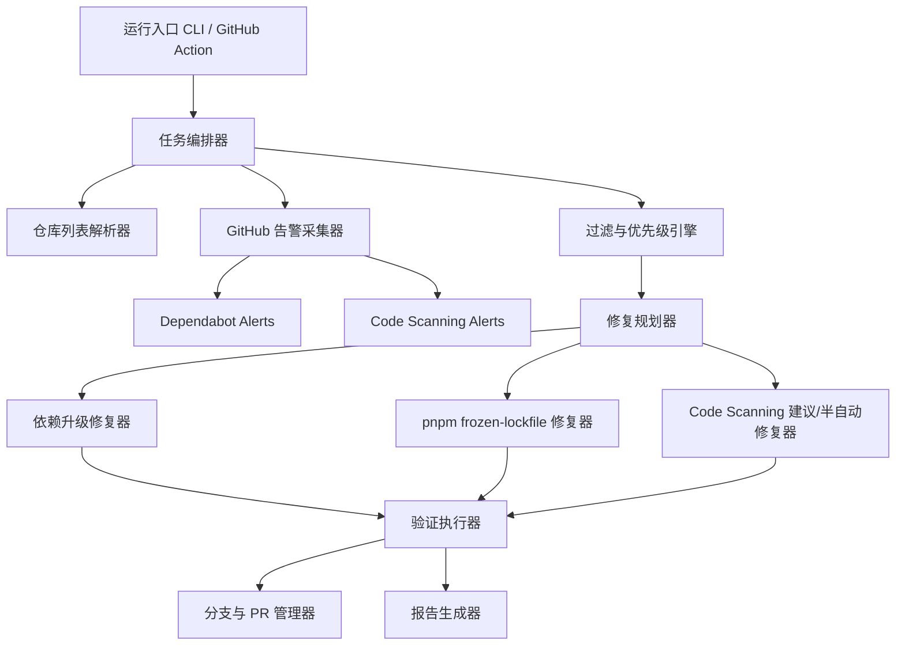

# 系统架构

## 项目组成

dependfix 由以下子项目组成：

```
dependfix/
├── apps/platform/       # Nuxt 全栈独立平台（Web UI + REST API）
├── packages/
│   ├── core/           # 核心业务逻辑库 @dependfix/core
│   ├── cli/            # CLI 入口 dependfix
│   ├── github/         # GitHub API 集成 @dependfix/github
│   ├── action/         # GitHub Action 入口 @dependfix/action
│   └── mcp/            # MCP Server @dependfix/mcp
└── docs/               # VitePress 文档站
```

## 总体方案

采用"统一编排器 + 告警采集器 + 修复执行器 + 报告器"的分层设计。



## 功能模块

### 入口层

- CLI 入口
- GitHub Action 入口
- 统一参数解析器

### 配置层

- 环境变量加载
- 仓库级配置读取
- 默认策略合并

### GitHub 集成层

- 认证与 API 客户端
- 告警拉取
- 仓库发现
- 分支、提交、PR、评论操作

### 核心域层

- 告警标准化模型
- 过滤与优先级模型
- 修复规划模型
- 执行结果模型

### 执行层

- 仓库克隆与工作目录管理
- 包管理器命令执行
- 质量门执行
- 失败回滚与清理

### 报告层

- 汇总统计
- 单仓库明细
- 告警-修复映射
- 失败原因归类

## 仓库列表获取

### 手动指定

- CLI 参数
- 环境变量
- 配置文件中的显式列表

### 自动发现

- organization / owner
- topic
- 默认分支
- 是否 archived / disabled
- 是否包含 `package.json` 或 `pnpm-lock.yaml`

首期优先支持"手动指定 + 基于 owner 自动发现"。

## 修复优先级

默认按以下顺序执行：

1. Critical 的依赖漏洞
2. High 的依赖漏洞
3. 会阻塞 CI 的 lockfile 问题
4. 可模板化处理的 code scanning 问题
5. 其余问题只输出建议

## 运行模式

### 本地直接运行

- `report-only`：只拉取告警并生成报告
- `fix`：执行修复但不推送
- `fix-and-pr`：执行修复并推送分支 / 创建 PR

### GitHub Action 运行

触发方式：`workflow_dispatch`、`schedule`

输入参数：owner / organization、repositories、severity-threshold、mode、max-repos、dry-run

## 专用 Agent 设计

### 角色定位

负责安全告警自动修复的任务编排：

- 拉取并统一标准化 GitHub 安全告警
- 根据配置决定要处理哪些仓库、哪些告警、哪些修复策略
- 调用对应技能完成采集、过滤、修复、验证和报告
- 在失败时给出结构化原因

### 输入

- GitHub Token / GitHub App 凭证
- 目标仓库列表或自动发现参数
- 修复策略配置
- 严重级别过滤规则
- 运行模式：`local`、`ci`、`report-only`、`fix`

### 输出

- 每个仓库的执行结果
- 已修复告警列表
- 未修复告警列表及原因
- 创建的分支、提交、PR、评论链接
- Markdown 报告与 JSON 报告

### 决策原则

- 默认先修复高收益、低风险问题
- 默认优先修复依赖问题，其次修复 lockfile 问题，最后处理可模板化的 code scanning 问题
- 当验证失败、升级跨度过大或需要业务判断时，停止自动提交，仅输出建议

## pnpm frozen-lockfile 自动修复

### 触发条件

- 修复依赖漏洞后安装失败
- 单独执行验证时 `pnpm i --frozen-lockfile` 失败
- 检测到 `package.json` 与 `pnpm-lock.yaml` 不一致

### 修复流程

1. 固定 Node 与 pnpm 版本
2. 读取并记录失败日志，识别是否属于 lockfile 漂移问题
3. 在工作分支中执行 lockfile 修复命令
4. 再次执行 `pnpm i --frozen-lockfile`
5. 若通过，进入后续 lint/build/test
6. 若仍失败，输出分类原因并停止自动提交

### 实现要点

- 在 GitHub Actions 中显式固定 pnpm 版本
- 在仓库配置中允许声明推荐 pnpm 版本
- 记录 lockfile diff 摘要
- 支持 `packageManager` 字段作为优先版本来源

## 报告设计

### Markdown 报告

- 运行元信息：时间、模式、阈值、仓库数
- 汇总统计：扫描仓库数、命中告警数、已修复数、失败数、跳过数
- 按仓库明细
- 按严重级别统计
- 按告警来源统计
- 失败原因分类
- 生成的 PR / 分支链接

### JSON 报告

- `runId`
- `startedAt` / `finishedAt`
- `config`
- `summary`
- `repositories[]`
- `alerts[]`
- `actions[]`
- `errors[]`

## 技术选型

技术选型与 [momei](https://github.com/CaoMeiYouRen/momei) 项目保持一致，优先复用已验证的成熟方案。

### 全栈平台（apps/platform）

| 类别 | 选型 | 来源 |
|------|------|------|
| 框架 | Nuxt 4（全栈 SSR + API Routes） | momei |
| 语言 | TypeScript（strict mode） | — |
| 包管理 | pnpm（workspace monorepo） | momei |
| UI 组件 | PrimeVue 4（基于 @primeuix/themes） | momei |
| 样式方案 | SCSS + BEM，暗色模式通过 `.dark` 类切换 | momei |
| 国际化 | @nuxtjs/i18n（prefix_and_default 策略） | momei |
| 认证 | better-auth（邮箱 + 第三方登录） | momei |
| ORM | TypeORM + TypeORM Adapter | momei |
| 数据库 | SQLite（开发）/ MySQL / PostgreSQL | momei |
| 任务队列 | BullMQ + Redis | — |
| 日志 | winston（结构化 JSON 日志） | momei |
| 监控 | Sentry（@sentry/nuxt） | momei |
| PWA | @vite-pwa/nuxt | momei |

### 库（packages/*）

| 类别 | 选型 |
|------|------|
| 构建 | tsdown（输出 ESM + CJS + dts） |
| 测试 | Vitest |
| E2E | Playwright |
| Lint | ESLint（eslint-config-cmyr） |
| 类型检查 | tsc --noEmit |
| 样式检查 | stylelint（stylelint-config-cmyr） |
| 提交规范 | commitlint（commitlint-config-cmyr） + commitizen |
| 版本发布 | semantic-release（semantic-release-cmyr-config） |

### 文档站（docs/）

| 类别 | 选型 |
|------|------|
| 框架 | VitePress |
| 国际化 | VitePress 内置 i18n（root + /en/ 前缀） |
| 主题 | 默认主题 |
| 搜索 | 本地搜索 |

## 平台架构（apps/platform）

### 前端

- Vue 3 Composition API + `<script setup lang="ts">`
- PrimeVue 4 + 自定义主题（暗色模式支持）
- SCSS + BEM 命名规范
- 移动端做适当响应式优化，但不是首要目标

### 后端

- Nuxt Server Routes 作为 REST API
- better-auth 处理认证会话
- TypeORM 实体 + 数据库迁移
- Zod 校验输入
- BullMQ + Redis 任务调度

### 暗色模式

- 通过 `<html>` 上的 `.dark` CSS class 切换
- PrimeVue 主题引擎通过 `darkModeSelector: '.dark'` 适配
- SCSS 使用 `:global(.dark) .selector` 覆盖样式
- 跟随系统偏好 + 用户手动切换

### 国际化

- 最低支持：简体中文（zh-CN，默认）+ 英文（en-US）
- 可扩展：zh-TW、ja-JP、ko-KR
- URL 策略：`prefix_and_default`（zh-CN 无前缀，en-US 加 `/en`）
- 语言检测：Cookie + 浏览器偏好 + URL

### 认证

- better-auth 为核心
- 内置：邮箱密码 + 邮箱验证
- 插件：username、magicLink、emailOTP、twoFactor、admin、jwt
- 第三方登录（可选）：GitHub OAuth、Google OAuth
- 数据库适配器：TypeORM Adapter
- 会话：数据库持久化 + Cookie

详见 [安全设计](security.md)。

## 主要风险与应对

| 风险 | 应对 |
|------|------|
| 自动修复误伤业务 | 默认只创建分支/PR 不自动合并；限制 major 升级；强制最小验证 |
| GitHub API 限流 | 批量分页拉取；并发控制；报告中记录被限流情况 |
| lockfile 修复不稳定 | 固定 Node 与 pnpm 版本；保存安装日志与 lockfile diff |
| Code Scanning 范围过大 | 首期只开放白名单规则；未命中白名单只做建议输出 |
| AI 研判误判 | AI 修复代码必须通过 lint/typecheck/build；PR 不自动合并；置信度低于阈值时仅输出建议；限制 patch 范围 |
| Prompt 注入攻击 | 限制触发权限为管理员；输入仅限结构化数据；系统指令硬编码；外部内容做清洗 |
| 多租户安全 | 仓库间数据隔离；用户 Token 加密存储；操作审计日志完整记录 |
