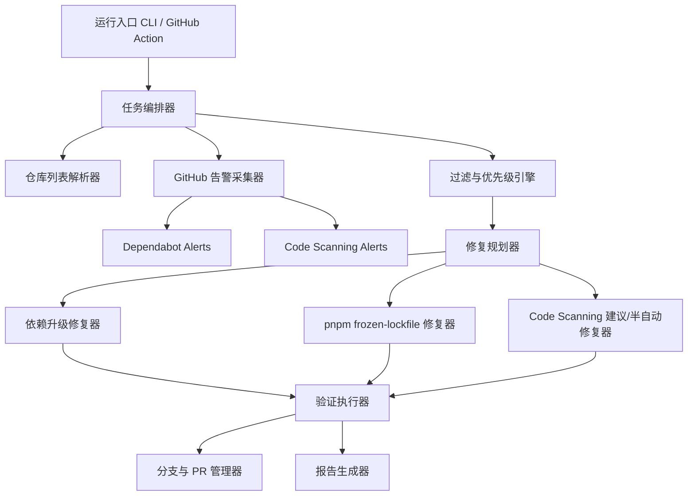

# 系统架构

> 状态: ✅ 已落地（2026-08-05 修正——对齐当前实现；早期规划见 git 历史）

## 项目组成

dependfix 由以下子项目组成（标 ✅ 的已落地，其余为规划中）：

```
dependfix/
├── packages/
│   ├── core/            # ✅ 核心业务逻辑库 @dependfix/core（告警模型/过滤/报告/日志/工具链）
│   ├── engine/          # ✅ 执行引擎 @dependfix/engine（github 采集/fixers 修复/config/编排内核，cli/mcp/platform 共享）
│   ├── cli/             # ✅ CLI 入口 dependfix（bin/参数解析/runner 薄壳/skills）
│   ├── github/          # ✅ 已并入 packages/engine/src/github/（client/fetcher/pr-creator）
│   ├── action/          # ✅ 已并入根 action.yml（Composite Action，M2 落地）
│   └── mcp/             # ✅ MCP Server @dependfix/mcp（M6 落地，依赖 engine）
├── action.yml           # ✅ GitHub Composite Action 入口（M2 已落地）
├── apps/platform/       # ✅ Nuxt 全栈管理平台（Web UI + REST API，M6 落地，依赖 engine）
└── docs/                # ✅ VitePress 文档站
```

> 注：M0 规划中的 `packages/github` 曾于 2026-08-05 目录收敛并入 `packages/cli/src/github/`（当时仅 cli 一个消费方）；**2026-08-09 修订**——mcp/platform 成为第二个/第三个消费方后，"应用层互相依赖（mcp → cli）"导致依赖连带膨胀与版本耦合，`github/` 与执行核心（fixers/config/app）拆入共享引擎包 `@dependfix/engine`（方案 B，见 [todo.md](../../plan/todo.md) 进行中任务），cli 薄壳化。`packages/action` 维持根 action.yml 形式。

## 总体方案

采用"统一编排器 + 告警采集器 + 修复执行器 + 报告器"的分层设计。



## 功能模块

### 入口层

- CLI 入口
- GitHub Action 入口
- 统一参数解析器

### 配置层

- 环境变量加载
- 仓库级配置读取
- 默认策略合并

### GitHub 集成层

- 认证与 API 客户端
- 告警拉取
- 仓库发现
- 分支、提交、PR、评论操作

### 核心域层

- 告警标准化模型
- 过滤与优先级模型
- 修复规划模型
- 执行结果模型

### 执行层

- 仓库克隆与工作目录管理
- 包管理器命令执行
- 质量门执行
- 失败回滚与清理

### 报告层

- 汇总统计
- 单仓库明细
- 告警-修复映射
- 失败原因归类

## 仓库列表获取

### 手动指定

- CLI 参数
- 环境变量
- 配置文件中的显式列表

### 自动发现

- organization / owner
- topic
- 默认分支
- 是否 archived / disabled
- 是否包含 `package.json` 或 `pnpm-lock.yaml`

首期优先支持"手动指定 + 基于 owner 自动发现"。

## 修复优先级

默认按以下顺序执行：

1. Critical 的依赖漏洞
2. High 的依赖漏洞
3. 会阻塞 CI 的 lockfile 问题
4. 可模板化处理的 code scanning 问题
5. 其余问题只输出建议

## 运行模式

### 本地直接运行

- `report-only`：只拉取告警并生成报告
- `fix`：执行修复但不推送
- `fix-and-pr`：执行修复并推送分支 / 创建 PR

### GitHub Action 运行

触发方式：`workflow_dispatch`、`schedule`

输入参数：owner / organization、repositories、severity-threshold、mode、max-repos、dry-run

## 专用 Agent 设计

### 角色定位

负责安全告警自动修复的任务编排：

- 拉取并统一标准化 GitHub 安全告警
- 根据配置决定要处理哪些仓库、哪些告警、哪些修复策略
- 调用对应技能完成采集、过滤、修复、验证和报告
- 在失败时给出结构化原因

### 输入

- GitHub Token / GitHub App 凭证
- 目标仓库列表或自动发现参数
- 修复策略配置
- 严重级别过滤规则
- 运行模式：`report-only`、`fix`、`fix-and-pr`

### 输出

- 每个仓库的执行结果
- 已修复告警列表
- 未修复告警列表及原因
- 创建的分支、提交、PR、评论链接
- Markdown 报告与 JSON 报告

### 决策原则

- 默认先修复高收益、低风险问题
- 默认优先修复依赖问题，其次修复 lockfile 问题，最后处理可模板化的 code scanning 问题
- 当验证失败、升级跨度过大或需要业务判断时，停止自动提交，仅输出建议

## pnpm frozen-lockfile 自动修复

### 触发条件

- 修复依赖漏洞后安装失败
- 单独执行验证时 `pnpm i --frozen-lockfile` 失败
- 检测到 `package.json` 与 `pnpm-lock.yaml` 不一致

### 修复流程

1. 固定 Node 与 pnpm 版本
2. 读取并记录失败日志，识别是否属于 lockfile 漂移问题
3. 在工作分支中执行 lockfile 修复命令
4. 再次执行 `pnpm i --frozen-lockfile`
5. 若通过，进入后续 lint/build/test
6. 若仍失败，输出分类原因并停止自动提交

### 实现要点

- 在 GitHub Actions 中显式固定 pnpm 版本
- 在仓库配置中允许声明推荐 pnpm 版本
- 记录 lockfile diff 摘要
- 支持 `packageManager` 字段作为优先版本来源

## 报告设计

### Markdown 报告

- 运行元信息：时间、模式、阈值、仓库数
- 汇总统计：扫描仓库数、命中告警数、已修复数、失败数、跳过数
- 按仓库明细
- 按严重级别统计
- 按告警来源统计
- 失败原因分类
- 生成的 PR / 分支链接

### JSON 报告

- `runId`
- `startedAt` / `finishedAt`
- `config`
- `summary`
- `repositories[]`
- `alerts[]`
- `actions[]`
- `errors[]`

## 技术选型

技术选型与 [momei](https://github.com/CaoMeiYouRen/momei) 项目保持一致，优先复用已验证的成熟方案。

### 全栈平台（apps/platform）

| 类别 | 选型 | 来源 |
|------|------|------|
| 框架 | Nuxt 4（全栈 SSR + API Routes） | momei |
| 语言 | TypeScript（strict mode） | — |
| 包管理 | pnpm（workspace monorepo） | momei |
| UI 组件 | PrimeVue 4（基于 @primeuix/themes） | momei |
| 样式方案 | SCSS + BEM，暗色模式通过 `.dark` 类切换 | momei |
| 国际化 | @nuxtjs/i18n（prefix_and_default 策略） | momei |
| 认证 | better-auth（邮箱 + 第三方登录） | momei |
| ORM | TypeORM + TypeORM Adapter | momei |
| 数据库 | SQLite（开发）/ MySQL / PostgreSQL | momei |
| 任务队列 | BullMQ + Redis | — |
| 日志 | winston（结构化 JSON 日志） | momei |
| 监控 | Sentry（@sentry/nuxt） | momei |
| PWA | @vite-pwa/nuxt | momei |

### 库（packages/*）

| 类别 | 选型 |
|------|------|
| 构建 | tsdown（输出 ESM + CJS + dts） |
| 测试 | Vitest |
| E2E | Playwright |
| Lint | ESLint（eslint-config-cmyr） |
| 类型检查 | tsc --noEmit |
| 样式检查 | stylelint（stylelint-config-cmyr） |
| 提交规范 | commitlint（commitlint-config-cmyr） + commitizen |
| 版本发布 | 自研 release 脚本（`release:plan` 推导 + `release:version` 版本提升 + `release:publish` 发布，见[发布管线设计](./release-pipeline.md)与[发布指南](../../guide/release.md)）+ `pnpm changelog`（conventional-changelog-cmyr-config 生成日志） |

### 文档站（docs/）

| 类别 | 选型 |
|------|------|
| 框架 | VitePress |
| 国际化 | VitePress 内置 i18n（root + /en/ 前缀） |
| 主题 | 默认主题 |
| 搜索 | 本地搜索 |

## 平台架构（apps/platform）

平台分两个阶段交付：

- **M6（最小平台 MVP）**：仓库 CRUD + 凭据管理 + 手动扫描 + 仪表板 + 单用户 + Docker Compose/SQLite（已交付 2026-08-08）
- **M7.1（认证与用户体系）**：RBAC 三角色（admin/org_admin/viewer）+ 用户管理 + 个人界面 + 认证扩展（AUTH_MODE 互斥：OIDC SSO / GitHub·Google OAuth / 域名黑白名单）；单组织模型（默认组织）——规划定稿 + 设计先行完成（2026-08-09）
- **M7.2（平台能力深化）**：BullMQ/Redis 任务队列 + 定时批量 + i18n + 生产部署（PostgreSQL/Helm/Sentry）+ 跨平台 Git + MCP 发布（见 [backlog.md §M7](../../plan/backlog.md#m7-企业级平台增强)）

### 分层架构

```
apps/platform/
├── pages/                    # Vue 3 页面
│   ├── dashboard/            # 总览仪表板
│   ├── repos/                # 仓库管理（列表/详情/配置）
│   ├── alerts/               # 告警视图（按仓库/按严重级别/按来源）
│   ├── runs/                 # 执行历史与报告
│   └── settings/             # 组织设置、凭据管理
├── server/
│   ├── api/                  # REST API
│   │   ├── repos/            # CRUD + 触发扫描
│   │   ├── alerts/           # 查询、过滤、修复状态
│   │   ├── runs/             # 扫描历史、报告
│   │   └── auth/             # better-auth
│   ├── services/             # 业务逻辑层
│   │   ├── repo-sync.service    # 仓库自动发现与同步
│   │   ├── scan-orchestrator    # 扫描编排（调用 core 包）
│   │   ├── credential.service   # Token 加密/解密
│   │   └── notification.service # 通知
│   └── queue/                # BullMQ（M7）
└── packages/shared/          # 前后端共享类型
```

### 核心数据模型

```
Organization (id / name / plan / createdAt)
  └── 1:N → Repository
              ├── owner / repo / platform(github)
              ├── defaultBranch / packageManager
              ├── credentialId → Credential (encryptedToken)
              └── 1:N → ScanRun
                          ├── mode / severityThreshold / status
                          ├── startedAt / finishedAt / summary
                          └── 1:N → ScanResult
                                      ├── alertId / source / severity
                                      ├── packageName / fixable / fixStrategy
                                      └── recommendedVersion / errorMessage
```

### 平台与现有 packages 的关系

```
packages/cli (dependfix)
    → 被 apps/platform/server/services/scan-orchestrator 引用
    → 平台模式下不用 CLI 参数解析，直接调用编排核心
    → 需要将 runCli 拆为"纯函数编排"和"CLI 入口"两层（T505）

packages/core (@dependfix/core)
    → apps/platform 直接依赖
    → 共享类型：NormalizedSecurityAlert, ToolchainInfo, ExecutionSummary
```

### 扫描调度策略（M7）

```
触发方式：
├── 手动触发（Web UI 点击）
├── 定时触发（cron，组织级配置）
└── 批量触发（选择多个仓库一次执行）

并发控制：
├── 全局最大并发数（如 5）
├── 单仓库互斥（同仓库同时只能一个扫描）
└── 优先级：手动 > 定时 > 批量
```

### 前端

- Vue 3 Composition API + `<script setup lang="ts">`
- PrimeVue 4 + 自定义主题（暗色模式支持）
- SCSS + BEM 命名规范
- 移动端做适当响应式优化，但不是首要目标

### 后端

- Nuxt Server Routes 作为 REST API
- better-auth 处理认证会话
- TypeORM 实体 + 数据库迁移
- SQLite（M6 开发/部署）/ PostgreSQL（M7 生产）
- Zod 校验输入
- BullMQ + Redis 任务调度（M7）

### 凭据安全

- GitHub PAT 使用平台级密钥（环境变量 `ENCRYPTION_KEY`）做 AES-256-GCM 加密后存储
- 解密仅在任务执行时、在 worker 内存中进行，用完即丢弃
- M6 单用户模式下凭据管理简化；M7 多用户模式下按组织隔离

### 暗色模式

- 通过 `<html>` 上的 `.dark` CSS class 切换
- PrimeVue 主题引擎通过 `darkModeSelector: '.dark'` 适配
- SCSS 使用 `:global(.dark) .selector` 覆盖样式
- 跟随系统偏好 + 用户手动切换

### 国际化（M7）

- 最低支持：简体中文（zh-CN，默认）+ 英文（en-US）
- 可扩展：zh-TW、ja-JP、ko-KR
- URL 策略：`prefix_and_default`（zh-CN 无前缀，en-US 加 `/en`）
- 语言检测：Cookie + 浏览器偏好 + URL

> M7.2 T708 任务定义与验收见 [todo-archive.md §M7.2](../../plan/todo-archive.md#m72-平台能力深化已归档)。

### 认证

- better-auth 为核心
- M6：邮箱密码 + 邮箱验证（单用户模式）
- M7 扩展（设计详见 [platform-auth-users.md](platform-auth-users.md)，2026-08-09 定稿）：
  - 插件：admin（用户管理，M7.1 启用）、genericOAuth（OIDC SSO，M7.1 启用）；username、magicLink、emailOTP、twoFactor、jwt 为架构预设但**未排期**（username 明确不启用——设计决策 D2）
  - 第三方登录：GitHub OAuth、Google OAuth（可选，未配置环境变量时自动禁用对应登录方式）
  - 未配置的第三方登录方式自动禁用，不阻塞启动
  - **部署模式互斥（2026-08-09 M7 规划决策）**：`AUTH_MODE=enterprise|public` 二选一，不混合——`enterprise`（企业内部）：OIDC SSO（better-auth `genericOAuth`，Azure AD / Okta / Keycloak / Google Workspace）+ 邮箱域名白名单注册准入；`public`（公开平台）：GitHub / Google OAuth + 邮箱域名黑名单注册准入。SAML 2.0 不实现（登记 backlog）
- 数据库适配器：TypeORM Adapter
- 会话：数据库持久化 + Cookie，过期 30 天，每日更新
- JWT 算法：EdDSA / Ed25519
- RBAC：M7 实现角色模型（Admin / Org Admin / Repo Admin / Viewer）

详见 [安全设计](security.md)。

## 主要风险与应对

| 风险 | 应对 |
|------|------|
| 自动修复误伤业务 | 默认只创建分支/PR 不自动合并；限制 major 升级；强制最小验证 |
| GitHub API 限流 | 批量分页拉取；并发控制；报告中记录被限流情况 |
| lockfile 修复不稳定 | 固定 Node 与 pnpm 版本；保存安装日志与 lockfile diff |
| Code Scanning 范围过大 | 首期只开放白名单规则；未命中白名单只做建议输出 |
| AI 研判误判 | AI 修复代码必须通过 lint/typecheck/build；PR 不自动合并；置信度低于阈值时仅输出建议；限制 patch 范围 |
| Prompt 注入攻击 | 限制触发权限为管理员；输入仅限结构化数据；系统指令硬编码；外部内容做清洗 |
| 多租户安全 | 仓库间数据隔离；用户 Token 加密存储；操作审计日志完整记录 |
