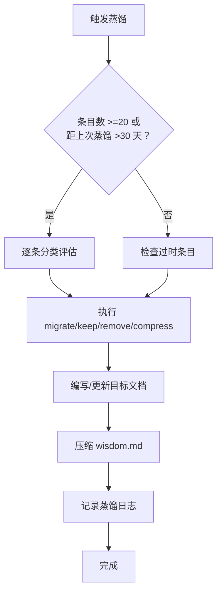

# Session Wisdom 蒸馏机制

> 将 `.session/wisdom.md` 中的临时知识点定期提纯为永久文档，解决跨机器丢失、内容膨胀与过时残留问题。
> 参照 momei [session-wisdom-distillation](https://github.com/CaoMeiYouRen/momei/blob/master/docs/design/governance/session-wisdom-distillation.md) 机制，按 dependfix 目录结构适配。

## 1. 背景

`.session/wisdom.md` 存储跨 session 值得复用的发现（pattern / bug / decision / env / test / baseline），已融入 `Full Stack Master (全栈大师)` agent 的 Session 感知协议（`.github/agents/full-stack-master.agent.md`）。

当前问题：

- **仅本地存储**：`.session/` 被 `.gitignore` 排除，换机器后 wisdom 丢失。
- **内容膨胀**：随 session 累积，条目过多时降低开局 briefing 的信息密度。
- **过时残留**：部分条目（如基线数据、已修复的 bug）不再有价值，但不清理就会持续占用阅读成本。
- **缺乏收敛**：有价值的 pattern/decision 应沉淀到 `docs/`，使其在所有分支和机器上可查。

## 2. 蒸馏触发条件

满足以下任一条件即触发蒸馏：

| 条件 | 阈值 | 说明 |
|:---|:---|:---|
| **条目数阈值** | `wisdom.md` 活跃条目 >= 20 条 | 活跃条目指未蒸馏、仍在本文件中的条目 |
| **时间阈值** | 距上次蒸馏超过 30 天 | 即使条目少也定期审视 |
| **阶段归档** | 当前阶段（M 里程碑）完成归档时 | 伴随阶段收口检查一次 |
| **用户主动触发** | 用户说"蒸馏 wisdom""整理 wisdom""distill wisdom" | 按需执行 |

## 3. 条目分类标准

### 3.1 类型 → 迁移目标映射（dependfix 目录结构）

| 条目标签 | 成熟度条件 | 迁移目标 | 示例 |
|:---|:---|:---|:---|
| `[bug]` | 已被后续 CI/测试验证稳定修复 | `docs/design/governance/` 对应治理文档 | P0 防护演进（多版本共存 overrides） |
| `[pattern]` | 被 2+ 个不同模块复用或验证有效 | `docs/standards/` 对应规范文档 | dry-run 纪律 → `ai-collaboration.md` |
| `[decision]` | 影响后续持续开发方向的架构选型 | `docs/design/packages/` 模块设计或 `docs/design/governance/` | 多版本共存分别 overrides → 修复链路设计 |
| `[env]` | 影响多台机器的环境配置/工具链 | `docs/guide/tech-stack.md` 或 `docs/guide/ai-development.md` | Windows 行尾纪律 |
| `[test]` | 可复用为项目测试规范 | `docs/standards/testing.md` | Review Gate 独立验证测试声明 |
| `[baseline]` | 作为后续对比基线 | `docs/research/` | 测试规模演进基线 |

### 3.2 条目处理结论

每条条目在蒸馏时获得以下结论之一：

| 结论 | 含义 | 行动 |
|:---|:---|:---|
| `→ migrate` | 迁移到 `docs/`，wisdom 中保留摘要+链接 | 写文档，压缩 wisdom 条目 |
| `→ keep` | 仍处于活跃学习期，暂不迁移 | 保留原文 |
| `→ remove` | 已过时、被 supersede 或不再相关 | 直接删除 |
| `→ compress` | 价值有限但可保留概要 | 仅保留一行摘要 |

## 4. 蒸馏工作流

### 4.1 标准流程



### 4.2 详细步骤

#### Step 1: 逐条评估

读取 `.session/wisdom.md` 中所有未蒸馏条目（即非"已蒸馏"区域的条目），逐条按 §3 标准判断结论。

#### Step 2: 执行迁移

- **`→ migrate` 条目**：将完整内容写入对应 `docs/` 目标的适当位置；更新目标文档时遵守外科式改动原则，不借机重构无关内容。
- **`→ remove` 条目**：直接删除。
- **`→ compress` 条目**：将多行详情压缩为单行摘要。
- **`→ keep` 条目**：保留不动。

#### Step 3: 压缩 wisdom.md

蒸馏后 `.session/wisdom.md` 的结构：

```markdown
# Session Wisdom (跨 Session 复用发现)

> 跨 session 发现的知识点。已迁移条目仅保留摘要与链接。
> 详细蒸馏流程见 [Session Wisdom 蒸馏机制](../docs/design/governance/session-wisdom-distillation.md)。

## 当前条目 (Active)

[YYYY-MM-DD] [type] 摘要 → 详见 `docs/path/to/doc.md`

## 已蒸馏条目 (Historical)

<!-- 仅保留摘要 + 链接，不再保留详细内容 -->
[YYYY-MM-DD] [type] 摘要 → 已迁移至 `docs/path/to/doc.md`
```

#### Step 4: 记录蒸馏日志

在蒸馏完成后，向当前 session 的 briefing 或 handoff 中说明：

- 迁移了多少条目
- 删除了多少过时条目
- 更新了哪些目标文档
- 当前剩余活跃条目数

### 4.3 脚本辅助

运行 `node scripts/distill-wisdom.mjs` 可输出当前 wisdom 的结构化分析报告，包含每条条目的类型分类、内容预览和推荐迁移目标，辅助人工判断。

```bash
node scripts/distill-wisdom.mjs          # 输出分析报告（控制台）
node scripts/distill-wisdom.mjs --check  # 仅检查条目数是否超阈值（供 hook 调用）
node scripts/distill-wisdom.mjs --threshold=15  # 自定义阈值
pnpm distill:wisdom                      # package.json script 别名
```

> `--check` 契约：退出码恒为 0（wisdom 缺失也 exit 0 跳过，供 hook 无脑调用）；是否需蒸馏通过 stdout 文本 `WISDOM_NEEDS_DISTILL: N active entries` / `WISDOM_OK: N active entries` 判断。

## 5. 集成到现有工作流

### 5.1 在 agent 流程中的位置

| 触发点 | 集成方式 |
|:---|:---|
| **Session 收尾**（Full Stack Master (全栈大师) agent） | 当 wisdom 条目数 >= 20 时，附加一句提醒："wisdom 条目数已达 N，建议执行蒸馏" |
| **阶段归档**（planning.md §4.3） | 在阶段归档最低验证中增加蒸馏检查项（已落地 2026-08-06） |
| **用户主动要求** | 直接执行完整蒸馏工作流 |

### 5.2 与 `documentation-specialist` 的协作

蒸馏涉及对 `docs/` 目录的写入，应接交 `documentation-specialist` 负责文档更新：

```
知识固化 → Full Stack Master (全栈大师) 评估分类
    ↓ 确认迁移目标
Full Stack Master (全栈大师) 判断 → documentation-specialist 编写/更新 docs/ 目标文档
    ↓ 审计
Code Auditor (代码审计员) Review Gate（文档变更属于正式审查对象）
    ↓ 压缩
Full Stack Master (全栈大师) 压缩 wisdom.md，删除/精简已迁移条目
```

### 5.3 蒸馏产物的提交策略

蒸馏产生的变更（wisdom.md 压缩 + docs/ 更新）应作为一个逻辑提交：

- 提交信息示例：`docs: session wisdom distillation — migrate N patterns to docs/standards, remove M outdated entries`
- 通过 `conventional-committer` 执行
- **注意**：`.session/wisdom.md` 本身被 `.gitignore` 排除，不入库；入库的是 `docs/` 目标文档与设计文档本身

## 6. 问答

### Q: 有些条目部分过时、部分仍有价值怎么办？

将仍有价值的部分迁移到文档，过时的部分直接丢弃。wisdom 中不保留"半过时"条目。

### Q: 迁移到 docs/ 后，wisdom 的摘要行还需要保留吗？

建议保留，用于追溯发现时间线。格式为 `[YYYY-MM-DD] [type] 单行摘要 → docs/path/to/doc.md`。

### Q: 蒸馏后发现文档位置不合适怎么办？

蒸馏不是一次性决策。后续发现文档位置不合适时，按正常文档重构流程移动到更合适的位置，并更新 wisdom 中的链接。

### Q: 迁移后的文档需要什么格式？

使用项目标准 Markdown 格式，遵守 `markdownlint` 规则和现有文档的目录约定。不做全景重写，只做增量插入。
