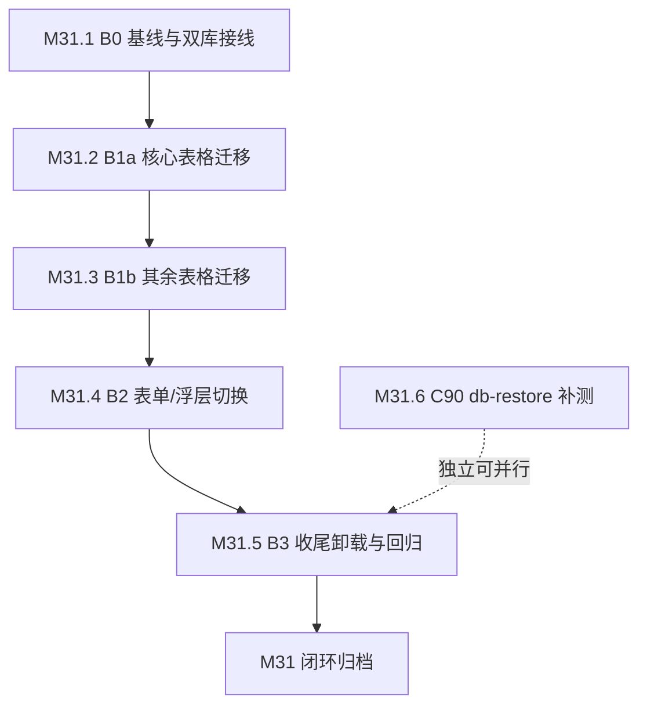

# 当前阶段待办

> 本文件**仅**登记当前阶段活跃待办；已闭环阶段归档于 [todo-archive.md](todo-archive.md)；未排期 / 延期 / 远期 / 长期主线 / 已知边界登记于 [backlog.md](backlog.md)。

---

## 文档位置速查

| 内容类型 | 位置 |
|:--|:--|
| 当前阶段任务 | 本文件（M31 进行中：apps/platform UI 组件库迁移） |
| 已完成阶段归档 | [todo-archive.md](todo-archive.md)（主窗口 + [archive/](archive/) 分片；M0-M30 全部已归档） |
| 未排期 / 延期 / 远期 / 长期主线 / 已知边界 | [backlog.md](backlog.md) |
| 里程碑与阶段交付 | [roadmap.md](roadmap.md)（M0-M30 已归档） |
| 历史归档索引 | [archive/index.md](archive/index.md) |

---

## 当前阶段

### M31：apps/platform UI 组件库迁移（PrimeVue → caomei-ui）

> **阶段目标**：把 `apps/platform` 从 PrimeVue 栈迁到 caomei-ui 0.3.0，卸载 5 个 PrimeVue 依赖（`primevue` / `@primevue/nuxt-module` / `@primeuix/themes` / `primeicons` / `primelocale`），消除「PrimeVue 4.x 冻结 / 5.x 转商业许可」的升级路径风险，并与多下游统一组件库。
>
> **依据**：[apps/platform UI 组件库迁移评估与方案](../design/governance/caomei-ui-migration.md)（§15.5 B0-B3 分批计划 + §15.6 0.3.0 破坏性变更）；M30.6 V1-V3 可行性验证全绿（commits `5eedcad` + `7be5b93`）。
>
> **用户决策（2026-09-28）**：方案 B（迁移主线 5 原子 + C90 测试补强 1 原子）；`--caomei-color-primary-solid` 覆盖 `#0f766e`（teal-700）达 AA 4.5:1；caomei-ui 精确锁定 `0.3.0`。C88 → M31.1-M31.5；C90 → M31.6（上收后从 backlog 移除）。
>
> **执行顺序**：M31.1 → M31.2 → M31.3 → M31.4 → M31.5（B0→B3 串行依赖）；M31.6 独立，可与迁移并行推进。

---

#### M31.1 [P2 🛡️ 技术债 / 前置基建] B0 迁移基线与双库并存接线

- **目标**：接入 `caomei-ui/nuxt` 0.3.0 并与 PrimeVue 双库并存，建立 token 映射与视觉基线，使后续批次可在同一应用内渐进切换。
- **范围**：`apps/platform/nuxt.config.ts`（`modules` + `caomeiUI` 配置）、`apps/platform/app/assets/scss/`（新增 `--caomei-*` token 覆盖）、`apps/platform/package.json`（确认 `caomei-ui: 0.3.0` 精确锁定）。
- **验收标准**：
  - [ ] `nuxt.config.ts` 注册 `caomei-ui/nuxt`（`prefix: 'Caomei'` + `darkMode: 'class'` + `theme.primary` teal），与 PrimeVue 模块并存不冲突
  - [ ] 样式入口为 0.3.0 的 `caomei-ui/theme.css`（非 0.1.0 的 `styles.css`）
  - [ ] `--caomei-color-primary-solid` 覆盖为 `#0f766e`（teal-700），实底白字对比度实测达 AA 4.5:1
  - [ ] 双库并存：既有 PrimeVue 页面与 `__migration-validation` 验证页均正常渲染，无 CSS 变量 / 类名冲突（`--p-*` vs `--caomei-*`）
  - [ ] `pnpm --filter @dependfix/platform typecheck` + `lint` + `build` 通过；构建产物 grep 确认 token 覆盖生效
- **不做什么**：不改任何现有业务页面的组件实现（B0 仅接线）；不卸载 PrimeVue；不改 i18n / 数据获取逻辑
- **依赖**：M30.6 V1-V3 全绿（[todo-archive.md §M30](todo-archive.md#m30-治理债清理--迁移可行性验证--能力扩展--测试补强m301m306-全部已闭环--2026-09-28-归档)）+ [评估文档 §15.6](../design/governance/caomei-ui-migration.md)
- **交付物**：1-2 atomic commits（`feat(platform)` nuxt 接线 + `docs(platform)` 基线登记）；视觉基线截图归档
- **风险与缓解**：双库 CSS 变量 / 类名冲突 → 命名空间已由 V2 验证隔离；token 覆盖未生效 → 构建产物 grep 兜底（`process.env` 折叠陷阱同类教训）
- **复杂度估算**：~3-5 文件（配置 + SCSS），无业务逻辑改写

---

#### M31.2 [P2 🎨 用户体验] B1a DataTable 核心页迁移（alerts + batch-runs）

- **目标**：`alerts.vue`（行分组 / 分组折叠 / 多列排序 / 降序优先）与 `batch-runs.vue`（行展开）从 PrimeVue DataTable 迁到 `CaomeiDataTable`，行为语义等价。
- **范围**：`apps/platform/app/pages/alerts.vue`、`apps/platform/app/pages/batch-runs.vue`（含其内联表格与相关子组件）、`apps/platform/tests/e2e/alerts*.e2e.test.ts` + `batch-runs*.e2e.test.ts`。
- **验收标准**：
  - [ ] alerts 行分组（`rowGroupMode="subheader"` + `#groupheader`）+ 分组折叠 + 多列排序（`sortMode="multiple"` + `sortDescFirst`）语义等价
  - [ ] batch-runs 行展开（`expander` 列 + `#expansion`）语义等价
  - [ ] 相关 e2e 选择器按 V3 映射表改写（`.p-datatable*` → `.caomei-datatable*`），用例语义保留
  - [ ] `pnpm --filter @dependfix/platform test` + 相关 `playwright test` 通过；无 hydration mismatch
- **不做什么**：不迁其余 DataTable 页（M31.3）；不改数据获取 / 过滤逻辑；不改 i18n
- **依赖**：M31.1（B0 接线）；[评估文档 §5.2 + §15.1 能力映射](../design/governance/caomei-ui-migration.md) + V3 选择器映射表（映射表正文见 commit `7be5b93`）
- **交付物**：多 commits（`refactor(platform)` 页面迁移 + `test(platform)` e2e 选择器改写）
- **风险与缓解**：`sortMode='multiple'` + `multiSortMeta` 类型与运行时差异（platform.md §7.1 PrimeVue 陷阱）→ 以 caomei `sortDescFirst` 显式对齐；e2e 选择器改写遗漏 → 按 V3 映射表逐条核对 `#groupheader` / `rowToggleButton`
- **复杂度估算**：~2-4 vue + 2-4 e2e 文件

---

#### M31.3 [P2 🎨 用户体验] B1b 其余 DataTable 页迁移（pr-checks / scans / repos / dashboard）

- **目标**：其余含表格页面从 PrimeVue DataTable 迁到 `CaomeiDataTable`，行为与迁移前等价。
- **范围**：`apps/platform/app/pages/{pr-checks,scans,repos,index}.vue` + 相关表格子组件、`apps/platform/tests/e2e/` 对应文件。
- **验收标准**：
  - [ ] 4 页表格（排序 / 分页 / 空态 / 加载态）行为等价
  - [ ] 对应 e2e 选择器改写完成，用例语义保留
  - [ ] `pnpm --filter @dependfix/platform test` + 相关 `playwright test` 通过
- **不做什么**：不动 alerts / batch-runs（M31.2 已完成）；不改页面业务逻辑；不改 i18n
- **依赖**：M31.1（B0）；与 M31.2 同源策略 + V3 映射表（正文见 commit `7be5b93`）
- **交付物**：多 commits（页面迁移 + e2e 改写）
- **风险与缓解**：分页器 `Paginator template` 缺口（评估 §15.3）→ 按映射表改写或原生 CSS；批量操作弹窗联动遗漏 → 逐页回归
- **复杂度估算**：~4-6 vue + 4-6 e2e 文件（超 10 文件时按页再拆分提交）

---

#### M31.4 [P2 🎨 用户体验] B2 表单 / 浮层 / 导航组件切换 + i18n 接线

- **目标**：非表格组件全量切换 + i18n / Toast / Confirm 接线，使页面不再依赖 PrimeVue 组件。
- **范围**：`apps/platform/app/**`（Dialog / Select→AutoComplete / MultiSelect / ToggleSwitch / InputText / Textarea / Toast / Confirm / Drawer / Tabs / Accordion / Tag / Button 等）+ `apps/platform/app/assets/scss/` 样式残留 + `apps/platform/app/plugins/`（Toast / Confirm 接线）+ i18n locale。
- **验收标准**：
  - [ ] Select 可搜索单选改 `AutoComplete` + `strict: true`；MultiSelect 删 `filter` / `display`（搜索内建常开 + chip 形态）
  - [ ] Toast / Confirm 从 PrimeVue service 切到 caomei 接线；i18n 内建文案随 zh / en 切换正确
  - [ ] 暗色模式（`.dark`）+ 响应式关键页无回归
  - [ ] `pnpm --filter @dependfix/platform typecheck` + `lint` + `test` 通过
- **不做什么**：不迁图表（`chart-canvas.vue` 自实现，与 PrimeVue 无关）；不改业务逻辑；不引入 Tailwind / UnoCSS
- **依赖**：M31.2 / M31.3（表格先迁）；[评估文档 §5.3 + §15.3](../design/governance/caomei-ui-migration.md)
- **交付物**：多 commits（组件切换 + 接线 + 样式清理）
- **风险与缓解**：表单组件 prop 语义差异（`severity` / `fluid` / `size="small"` 等）→ 按 §5.4 通用属性映射表逐项改写；Toast / Confirm 接线遗漏 → 全量 `rg "useToast|useConfirm"` 核对
- **复杂度估算**：~10+ vue 文件（需按目录拆分提交，遵守单批 < 10 文件）

---

#### M31.5 [P2 🛡️ 技术债] B3 收尾：依赖卸载 + 全量回归 + 文档同步

- **目标**：卸载 5 个 PrimeVue 依赖，清零 PrimeVue 引用，e2e 全量通过，产出包体对比，清理迁移验证产物。
- **范围**：`apps/platform/package.json` + `pnpm-lock.yaml`、`apps/platform/nuxt.config.ts`、删除 `apps/platform/app/pages/__migration-validation/`、`docs/standards/platform.md §7.1`、`docs/guide/tech-stack.md`、`docs/design/governance/caomei-ui-migration.md`（状态更新）。
- **验收标准**：
  - [ ] 5 个 PrimeVue 依赖从 `package.json` 卸载（`primevue` / `@primevue/nuxt-module` / `@primeuix/themes` / `primeicons` / `primelocale`）
  - [ ] `rg "primevue|--p-[a-z]|\.p-[a-z]" apps/platform/{app,server,tests,nuxt.config.ts}` 归零（排除文档性注释）
  - [ ] `pnpm --filter @dependfix/platform typecheck` + `lint` + `test` + `build` 通过；e2e 全量通过
  - [ ] 迁移前后包体对比记录产出；`__migration-validation` 验证页移除
  - [ ] `platform.md §7.1` / `tech-stack.md` / 评估文档状态同步（PrimeVue 集成实践段改为 caomei-ui）
- **不做什么**：不升级 PrimeVue 5.x；不申请 PrimeUI 商业许可；不迁移图表；不做无关重构
- **依赖**：M31.4（全部组件切换完成）；[评估文档 §10 验收标准](../design/governance/caomei-ui-migration.md)
- **交付物**：1-3 atomic commits（`chore(platform)` 依赖卸载 + `docs(platform)` 文档同步）+ 包体对比留痕
- **风险与缓解**：卸载后遗漏引用 → 全量 `rg` + build 兜底；e2e 残留 `p-*` 断言 → 全量 rg e2e 目录；卸载导致平台不可构建 → 回滚依赖提交并定位遗漏引用
- **复杂度估算**：依赖 + 配置 + 文档 ~5-8 文件；删除 1 个验证目录

---

#### M31.6 [P3 🧪 测试覆盖] C90 db-restore ESM mock 受限失败分支补测

- **目标**：补齐 `db-restore.ts` 因 ESM 模块 mock 受限而 `it.skip` 的两条失败分支测试（恢复后 `integrity_check` 失败注入 / sidecar `unlinkSync` 部分失败的 `removedSidecars` 状态一致性）。
- **范围**：`apps/platform/server/database/scripts/db-restore.ts` + `db-restore.test.ts`（测试架构调整或可注入化重构）。
- **验收标准**：
  - [ ] 两条 `it.skip` 分支转为实际断言（skip 清零）
  - [ ] 既有 db-restore 测试全过（行为不变）
  - [ ] `pnpm lint` + `pnpm typecheck` + `pnpm --filter @dependfix/platform test` 通过
- **不做什么**：不改 `db-restore` CLI 语义（`--from` / `--yes` 双门控）；不引入新测试框架
- **依赖**：M30.5（触发来源）；[testing.md §6.6 ESM mock 受限处理原则](../standards/testing.md)
- **交付物**：1-2 atomic commits（`test(platform)` 补测 + 必要时的 `refactor(platform)` 可注入化）
- **风险与缓解**：为可测性重构生产代码可能引入行为回归 → 优先不改生产代码方案（进程级隔离 / `vi.mock`），重构须行为等价并回归既有测试
- **复杂度估算**：测试架构 ~40-80 行；测试 2 case；文档 0

---

## 类型平衡复核

| 类型 | 条目 | 状态 |
|:--|:--|:--|
| 🎨 用户体验 | M31.2、M31.3、M31.4 | ✅ 3 项 |
| 🛡️ 技术债 / 治本 | M31.1、M31.5 | ✅ 2 项 |
| 🧪 测试覆盖 | M31.6 | ✅ 1 项 |
| 🚀 能力扩展 | *当前批次以迁移为主线，无独立能力扩展条目* | ⚠️ 显式标注缺口 |
| 📚 治理 / 文档 | *随 M31.5 收口（platform.md / tech-stack.md / 评估文档同步）* | ⚠️ 无独立条目（含于 M31.5） |

> 说明：M31 为迁移主线阶段，🚀 / 📚 无独立条目为已知缺口；C89（Code Scanning 未启用细分）/ C85（目标仓库专属配置）等 🚀 候选仍在 backlog 待后续阶段上收。

---

## 执行依赖与顺序

> B0→B3 为串行依赖（后一批次依赖前一批次完成）；M31.6 独立于迁移链路，可穿插并行。
