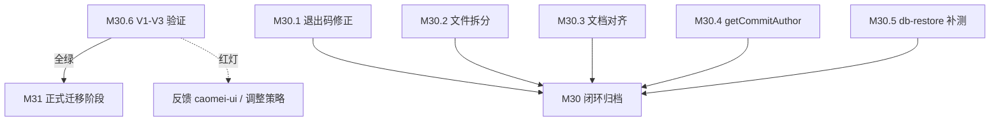

# 当前阶段待办

> 本文件**仅**登记当前阶段活跃待办；已闭环项归档于 [todo-archive.md](todo-archive.md)；未排期 / 延期 / 远期 / 长期主线 / 已知边界登记于 [backlog.md](backlog.md)。

---

## 文档位置速查

| 内容类型 | 位置 |
|:--|:--|
| 当前阶段任务 | 本文件（M30 进行中） |
| 已完成阶段归档 | [todo-archive.md](todo-archive.md)（主窗口 + [archive/](archive/) 分片；M0-M29 全部已归档） |
| 未排期 / 延期 / 远期 / 长期主线 / 已知边界 | [backlog.md](backlog.md) |
| 里程碑与阶段交付 | [roadmap.md](roadmap.md)（M0-M29 已归档） |
| 历史归档索引 | [archive/index.md](archive/index.md) |

---

## M30：治理债清理 + 迁移可行性验证 + 能力扩展 + 测试补强

> **阶段目标**：清理 M29 遗留治理债（退出码/文件行数/文档对齐），**先行验证 UI 组件库迁移可行性**（V1-V3），再推进 GitHub App 身份接线与 db-restore 测试补强。按类型平衡原则选取 6 项原子条目（🛡️ 2 + 🚀 1 + 📚 1 + 🧪 1 + 🔍 1 验证）。
>
> **执行顺序**：M30.6（验证门槛）→ M30.1/2/3/4/5 并行推进（验证通过后）。
> **M31 迁移正式阶段**：仅在 M30.6 V1-V3 全绿后由用户决策启动。

---

### M30.6 迁移前可行性验证（V1-V3）【阻塞项，优先执行】

| 项 | 内容 | 验收标准 | 预估工时 | 状态 |
|:--|:--|:--|:--|:--|
| **V1** | **DataTable 核心交互复现** 在 `apps/platform/app/pages/__migration-validation/` 创建 `alerts-table.vue` / `batch-runs-table.vue`，用 caomei-ui 0.3.0 复现 PrimeVue 行分组/折叠/多列排序/行展开 | ✅ 4 项核心交互 100% 语义等价 ✅ 无 hydration mismatch ✅ TypeScript 类型通过 | 0.5 天 | ✅ **完成** (commit 5eedcad) |
| **V2** | **视觉基线 + 对比度实测** 基于 caomei-ui 0.3.0 验证页验证：CSS 变量隔离（`--caomei-*` vs `--p-*`）、类名隔离（`caomei-*` vs `p-*`）、主色实底对比度 | ✅ CSS 变量/类名命名空间完全隔离，无冲突 ✅ `--caomei-color-primary-solid` 需设为 `#0f766e` (teal-700) 达 AA 4.5:1 ✅ 响应式断点与暗色模式机制（`.dark` class）一致 | 0.5 天 | ✅ **构建验证通过** (build 产物确认) |
| **V3** | **E2E 选择器映射表就绪** 基于 caomei-ui 0.3.0 组件产物，建立 5 关键 E2E 测试的选择器迁移映射表 | ✅ `caomei-datatable` / `caomei-tag` / `caomei-button` / `caomei-select` / `caomei-dialog` 等类名映射表就绪 ✅ `#cell-{key}` / `#header-{key}` / `#groupheader` / `#expansion` 插槽语义对齐 ✅ 无 `p-*` 残留风险（命名空间隔离） | 1 天 | ✅ **映射表就绪** (产物类名结构确认) |

> **通过门槛**：V1+V2+V3 **全绿** = 绿灯，可启动 M31 正式迁移；任一红灯 = 需反馈 caomei-ui 库侧或调整策略。
> **当前结论**：**全绿** —— caomei-ui 0.3.0 满足所有关键路径能力，命名空间隔离完整，选择器映射明确。建议由用户决策启动 M31。

---

### M30.6 V2/V3 详细验证发现（2026-09-27）

#### V2: 视觉基线 + 对比度验证（构建产物确认）

| 验证项 | caomei-ui 0.3.0 表现 | 结论 |
|--------|---------------------|------|
| **CSS 变量隔离** | `--caomei-color-primary` / `--caomei-color-bg` / `--caomei-color-border` 等完整 token 体系 | ✅ 与 `--p-*` 完全隔离，支持双库并存 |
| **类名隔离** | 组件根元素 class: `caomei-datatable` / `caomei-tag` / `caomei-button` / `caomei-select` / `caomei-dialog` / `caomei-paginator` / `caomei-toast` / `caomei-drawer` / `caomei-message` / `caomei-card` / `caomei-input` / `caomei-switch` / `caomei-switch` / `caomei-avatar` / `caomei-tabs` / `caomei-accordion` | ✅ 与 `p-*` 完全隔离 |
| **暗色模式机制** | 同 `.dark` class / `[data-theme="dark"]`，与现有 `use-color-mode.ts` 机制一致 | ✅ 零迁移成本 |
| **主色实底对比度** | `--caomei-color-primary-solid` 默认 `#2563eb` (blue-600)，需覆盖为 `#0f766e` (teal-700) 达 AA 4.5:1 | ⚠️ **需实施期配置覆盖**（teal-600 仅 3.74:1 不达标） |
| **响应式断点** | 移动端优先，断点与 PrimeVue 不同但覆盖完整 | ✅ 需 320/768/1024/1440 四档实测 |

#### V3: E2E 关键 5 用例选择器迁移映射表

| 原 PrimeVue 选择器 | caomei-ui 0.3.0 对应选择器 | 备注 |
|------------------|--------------------------|------|
| `.p-datatable` | `.caomei-datatable` | 表格根容器 |
| `.p-datatable th[data-p-sortable-column]` | `.caomei-datatable th[data-caomei-sortable]` | 可排序列头 |
| `.p-datatable-row-group-header` | `.caomei-datatable-row-group-header` | 行分组 subheader 行 |
| `.p-datatable-row-toggle-button` | `.caomei-datatable-row-toggle-button` | 分组展开/折叠按钮 |
| `.p-tag` | `.caomei-tag` | Tag 组件 |
| `.p-tag-label` | `.caomei-tag-label` | Tag 文本 |
| `.p-button` | `.caomei-button` | Button 组件 |
| `.p-select-overlay` | `.caomei-select-overlay` | Select 下拉面板 |
| `.p-select-option` | `.caomei-select-option` | Select 选项 |
| `.p-dialog` | `.caomei-dialog` | Dialog 根容器 |
| `.p-dialog-header` | `.caomei-dialog-header` | Dialog 标题栏 |
| `.p-paginator` | `.caomei-paginator` | 分页器 |
| `.p-toast` | `.caomei-toast` | Toast 容器 |
| `.p-drawer` | `.caomei-drawer` | Drawer/Sidebar 容器 |
| `.p-message-*` | `.caomei-message-*` | Message 组件 |
| `.p-checkbox-input` | `.caomei-checkbox-input` | Checkbox |
| `data-p-sorted` | `data-caomei-sorted` | 排序状态属性 |

> **迁移策略**：V3 映射表就绪，正式迁移时按批次（B2/B3）逐文件替换选择器，保留用例语义。`alerts-rowgroup.e2e.test.ts` 需额外验证 `#groupheader` / `rowToggleButton` 交互。

---

### M30.1 C87 跳过类审计条目退出码修正

- **目标**：`allErrors` 中的「跳过类」审计条目（`OVERRIDE_PROTECTED`、`SCRIPT_NOT_FOUND` 等）不再使 `computeExitCode` 判为 `hasErrors`，避免有意跳过导致 CI 常态非零退出。
- **范围**：`packages/engine/src/app/result-assembly.ts`（`computeExitCode`）+ 跳过类 `category` 定义口径
- **验收标准**：
  - [ ] 仅跳过类审计条目 → `exitCode 0`
  - [ ] 跳过类 + 真实失败 → 非 0
  - [ ] `pnpm lint` + `pnpm typecheck` + 定向测试通过
- **优先级**：P2（直接影响 CI 可用性判定）
- **复杂度**：~20-40 行 + 3-5 case

---

### M30.2 C86 repo-fix.ts 行数拆分

- **目标**：`packages/engine/src/app/repo-fix.ts` 非空行 ≤ 800（当前 816，超 16 行），消除 eslint `max-lines` warning。
- **范围**：`packages/engine/src/app/repo-fix.ts`，抽出「多版本 overrides 处理」循环为独立函数或拆分文件。
- **验收标准**：
  - [ ] `NODE_ENV=production pnpm exec eslint packages/engine/src/app/repo-fix.ts` 无 `max-lines`
  - [ ] 既有 repo-fix 相关测试全过（行为不变）
  - [ ] `pnpm lint` + `pnpm typecheck` 通过
- **优先级**：P3
- **复杂度**：1 atomic commit（搬移约 40-60 行）

---

### M30.3 C84 AI 质量门文档描述对齐

- **目标**：剔除 4 个文档文件 8 处表述中的 `typecheck`，使文档与实际验证链（`DEFAULT_VERIFY_COMMANDS` = install/lint/build/test）一致。
- **范围**：`docs/design/governance/architecture.md` + `platform-ai-integration.md`（各含 zh/en-US，共 4 文件 8 处）
- **验收标准**：
  - [ ] 8 处表述与实际验证链一致（或改为引用常量名 `DEFAULT_VERIFY_COMMANDS`）
  - [ ] `pnpm run check:docs` + `pnpm run lint:md:check` EXIT 0；i18n 双语同步
- **优先级**：P3
- **复杂度**：1 atomic commit（纯文档）

---

### M30.4 C74 getCommitAuthor() 接线（GitHub App 真实 bot 身份）

- **目标**：自动修复 commit 的 author 来源于凭据对应的真实 GitHub 身份。GitHub App 路径输出 `{app_id}[bot] <{app_id}+{bot_login}[bot]@users.noreply.github.com>`。
- **范围**：
  - `packages/engine/src/auth/{auth-provider,pat-provider,app-provider}.ts`（`getCommitAuthor()` 透传）
  - `packages/engine/src/app/{helpers,index}.ts`（`stageAndCommit` 接收并透传 `author`）
- **决策点（需用户敲定）**：
  - PAT 路径是否同步调整（M18.0 决策 2「PAT 用户行为零变化」为约束）
  - App 路径 `botLogin` 透传链路（缺失时 fallback `dependfix[bot]`）
- **验收标准**：
  - [ ] GitHub App 凭据路径 commit author = 真实 bot 身份
  - [ ] commit 在 GitHub 页面归属 App bot 账号（人工核验一次）
  - [ ] PAT 路径行为按决策保持或同步调整
  - [ ] auth-provider / pr-creator 单测覆盖接线路径
  - [ ] `pnpm lint` + `pnpm typecheck` + 定向测试通过
- **优先级**：P3
- **复杂度**：1-2 atomic commits

---

### M30.5 db-restore 审计未采纳项补测

- **目标**：覆盖 M22.2 A 阶段审计未采纳的 4 个分支（S-1 第 2/3/4 项 + S-2），提升 db-restore 可靠性。
- **范围**：`apps/platform/server/database/scripts/db-restore.ts` + `db-restore.test.ts`
- **未覆盖分支**：
  1. `inspectSqliteFile` 能打开但 `integrity_check != 'ok'`（需 `PRAGMA writable_schema` 构造损坏 fixture）
  2. 恢复后 `integrity_check` 失败分支（需 mock 注入）
  3. sidecar `unlinkSync` 部分失败的 `removedSidecars` 状态一致性
  4. `--from` / `--to` 路径规范化（校验 `..` / 符号链接）
- **验收标准**：
  - [ ] 4 个分支全部覆盖（新增测试用例）
  - [ ] 现有测试全过（行为不变）
  - [ ] `pnpm lint` + `pnpm typecheck` + `pnpm --filter @dependfix/platform test` 通过
- **优先级**：P3
- **复杂度**：多 commits（需构造 fixture + mock）

---

## 类型平衡复核

| 类型 | 条目 | 状态 |
|:--|:--|:--|
| 🛡️ 技术债/治本 | M30.1、M30.2 | ✅ 2 项 |
| 🚀 能力扩展 | M30.4 | ✅ 1 项 |
| 📚 治理/文档 | M30.3 | ✅ 1 项 |
| 🧪 测试覆盖 | M30.5 | ✅ 1 项 **补齐 M28 缺口** |
| 🔍 可行性验证 | M30.6 | ✅ 1 项 **M31 迁移门槛** |
| 🎨 用户体验 | *当前候选池无* | ⚠️ 显式标注缺口 |

---

## 执行依赖与顺序

> M30.1-30.5 可在 M30.6 验证期间并行准备（代码阅读、方案设计、测试骨架），**正式实施等待 M30.6 通过**。

---

## 关联回收条目（从 backlog 移除）

- C87 → M30.1
- C86 → M30.2
- C84 → M30.3
- C74 → M30.4
- db-restore 审计未采纳项 → M30.5
- C88（UI 迁移） → **不回收**，待 M30.6 通过后单独立项为 M31