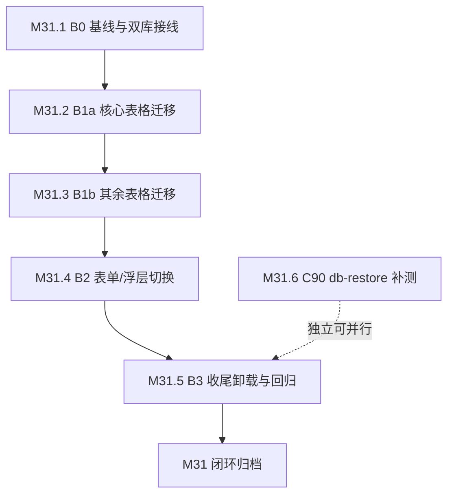

# 当前阶段待办

> 本文件**仅**登记当前阶段活跃待办；已闭环阶段归档于 [todo-archive.md](todo-archive.md)；未排期 / 延期 / 远期 / 长期主线 / 已知边界登记于 [backlog.md](backlog.md)。

---

## 文档位置速查

| 内容类型 | 位置 |
|:--|:--|
| 当前阶段任务 | 本文件（M31 进行中：apps/platform UI 组件库迁移） |
| 已完成阶段归档 | [todo-archive.md](todo-archive.md)（主窗口 + [archive/](archive/) 分片；M0-M30 全部已归档） |
| 未排期 / 延期 / 远期 / 长期主线 / 已知边界 | [backlog.md](backlog.md) |
| 里程碑与阶段交付 | [roadmap.md](roadmap.md)（M0-M30 已归档） |
| 历史归档索引 | [archive/index.md](archive/index.md) |

---

## 当前阶段

### M31：apps/platform UI 组件库迁移（PrimeVue → caomei-ui）

> **阶段目标**：把 `apps/platform` 从 PrimeVue 栈迁到 caomei-ui 0.3.0，卸载 5 个 PrimeVue 依赖（`primevue` / `@primevue/nuxt-module` / `@primeuix/themes` / `primeicons` / `primelocale`），消除「PrimeVue 4.x 冻结 / 5.x 转商业许可」的升级路径风险，并与多下游统一组件库。
>
> **依据**：[apps/platform UI 组件库迁移评估与方案](../design/governance/caomei-ui-migration.md)（§15.5 B0-B3 分批计划 + §15.6 0.3.0 破坏性变更）；M30.6 V1-V3 可行性验证全绿（commits `5eedcad` + `7be5b93`）。
>
> **用户决策（2026-09-28）**：方案 B（迁移主线 5 原子 + C90 测试补强 1 原子）；`--caomei-color-primary-solid` 覆盖 `#0f766e`（teal-700）达 AA 4.5:1；caomei-ui 精确锁定 `0.3.0`。C88 → M31.1-M31.5；C90 → M31.6（上收后从 backlog 移除）。
>
> **执行顺序**：M31.1 → M31.2 → M31.3 → M31.4 → M31.5（B0→B3 串行依赖）；M31.6 独立，可与迁移并行推进。
>
> **进度（2026-09-29）**：**M31.1-M31.5 已完成，迁移主线闭环**（PrimeVue 5 依赖已卸载、代码侧引用归零、e2e 173 passed、包体 client gzip −59.8%）；M31.6 待启动。

---

#### M31.1 [P2 🛡️ 技术债 / 前置基建] B0 迁移基线与双库并存接线

- **目标**：接入 `caomei-ui/nuxt` 0.3.0 并与 PrimeVue 双库并存，建立 token 映射与视觉基线，使后续批次可在同一应用内渐进切换。
- **范围**：`apps/platform/nuxt.config.ts`（`modules` + `caomeiUI` 配置 + `primevue.composables.exclude`）、`apps/platform/app/assets/styles/`（新增 `_caomei-tokens.scss` + `main.scss` 引入）、`apps/platform/app/pages/__migration-validation/*`（模块注册后暴露的类型/API 对齐）、`apps/platform/package.json`（确认 `caomei-ui: 0.3.0` 精确锁定）。
- **验收标准**：
  - [x] `nuxt.config.ts` 注册 `caomei-ui/nuxt`（`prefix: 'Caomei'` + `darkMode: 'class'` + `theme.primary` teal），与 PrimeVue 模块并存不冲突
  - [x] 样式入口为 0.3.0 的 `caomei-ui/theme.css`（非 0.1.0 的 `styles.css`）
  - [x] `--caomei-color-primary-solid` 覆盖为 `#0f766e`（teal-700），实底白字对比度实测达 AA 4.5:1（实测 5.47:1）
  - [x] 双库并存：既有 PrimeVue 页面与 `__migration-validation` 验证页均正常渲染，无 CSS 变量 / 类名冲突（`--p-*` vs `--caomei-*`）
  - [x] `pnpm --filter @dependfix/platform typecheck` + `lint` + `build` 通过；构建产物 grep 确认 token 覆盖生效
- **不做什么**：不改任何现有业务页面的组件实现（B0 仅接线）；不卸载 PrimeVue；不改 i18n / 数据获取逻辑
- **依赖**：M30.6 V1-V3 全绿（[todo-archive.md §M30](todo-archive.md#m30-治理债清理--迁移可行性验证--能力扩展--测试补强m301m306-全部已闭环--2026-09-28-归档)）+ [评估文档 §15.6](../design/governance/caomei-ui-migration.md) + [§15.9 验证覆盖缺口修订](../design/governance/caomei-ui-migration.md#159-b0-接线暴露的验证覆盖缺口m31-各批次须补齐)
- **交付物**：1-2 atomic commits（`feat(platform)` nuxt 接线 + `docs(platform)` 基线登记）；视觉基线证据归档于 gitignored `artifacts/m31-b0/`（受仓库 `*.png` 全局忽略约束，不入 Git：截图 ×5 + 浏览器断言脚本）
- **风险与缓解**：双库 CSS 变量 / 类名冲突 → 命名空间已由 V2 验证隔离；token 覆盖未生效 → 构建产物 grep 兜底（`process.env` 折叠陷阱同类教训）
- **复杂度估算**：~3-5 文件（配置 + SCSS），无业务逻辑改写

---

#### M31.2 [P2 🎨 用户体验] B1a DataTable 核心页迁移（alerts + batch-runs）

- **目标**：`alerts.vue`（行分组 / 分组折叠 / 多列排序 / 降序优先）与 `batch-runs.vue`（行展开）从 PrimeVue DataTable 迁到 `CaomeiDataTable`，行为语义等价。
- **范围**：`apps/platform/app/pages/alerts.vue`、`apps/platform/app/pages/batch-runs.vue`（含其内联表格与相关子组件）、`apps/platform/tests/e2e/alerts*.e2e.test.ts` + `batch-runs*.e2e.test.ts`。
- **验收标准**：
  - [x] alerts 行分组（`rowGroupMode="subheader"` + `#groupheader`）+ 分组折叠 + 多列排序（`sortMode="multiple"` + `multiSortMeta` 初值承载默认方向）语义等价（实测循环与默认顺序与 PrimeVue 逐项一致，见评估文档 §15.10）
  - [x] batch-runs 行展开（`expander` 列 + `#expansion`）语义等价
  - [x] 相关 e2e 选择器按 [评估文档 §15.8 映射表](../design/governance/caomei-ui-migration.md#158-选择器映射表更正2026-09-28b0-接线实证) 改写（`.p-datatable*` → `.caomei-data-table__*`，注意类名为逐词 kebab-case），用例语义保留
  - [x] `pnpm --filter @dependfix/platform test` + 相关 `playwright test` 通过（相关子集 26 条全绿；全量 172 条用例中 170 passed / 1 failed+1 flaky，均为未迁移页的用例顺序相关抖动，见评估文档 §15.10 第 9 条）；无 hydration mismatch
- **不做什么**：不迁其余 DataTable 页（M31.3）；不改数据获取 / 过滤逻辑；不改 i18n
- **依赖**：M31.1（B0 接线）；[评估文档 §5.2 + §15.1 能力映射](../design/governance/caomei-ui-migration.md#151-关键路径阻塞点闭环确认) + [§15.8 选择器映射表](../design/governance/caomei-ui-migration.md#158-选择器映射表更正2026-09-28b0-接线实证) + [§15.9 验证缺口](../design/governance/caomei-ui-migration.md#159-b0-接线暴露的验证覆盖缺口m31-各批次须补齐)
- **交付物**：多 commits（`refactor(platform)` 页面迁移 + `test(platform)` e2e 选择器改写）
- **风险与缓解**：`sortMode='multiple'` + `multiSortMeta` 类型与运行时差异（迁移前组件库的类型 / 运行时不一致陷阱，该节已随 M31 收口，陷阱正文见 [归档页](archive/todo-archive-phases-m24.md)）→ 实测 caomei 全局 `sortDescFirst` 会改变点击循环，改为由 `multi-sort-meta` 初值承载默认方向（§15.10 第 1 条）；受控 `expandedRowGroups` / `expandedRows` 漏回写会致内建按钮失效（B0 实证）→ 以 prop + `@update:*` 回写保真 `v-model` 语义；e2e 选择器改写遗漏 → 按 §15.8 + §15.10 第 6 条映射表逐条核对 `.caomei-data-table__row-group-toggle` / `__sort` / `th[aria-sort]`
- **复杂度估算**：~2-4 vue + 2-4 e2e 文件

---

#### M31.3 [P2 🎨 用户体验] B1b 其余表页全量迁移（PrimeVue DataTable → caomei）

- **目标**：其余含表格页面从 PrimeVue DataTable 迁到 `CaomeiDataTable`，行为与迁移前等价。
- **范围**：按用户裁定扩为**全部剩余表页与表子组件**（实际范围与逐文件清单见[评估文档 §15.11](../design/governance/caomei-ui-migration.md#1511-其余表页迁移实证m3132026-09-28)；计划原文仅点名 `pr-checks/scans/repos/index`，其中 `index.vue` 为跳转页、`dashboard.vue` 无表格）+ `apps/platform/tests/e2e/` 对应文件。
- **验收标准**：
  - [x] 4 页表格（排序 / 分页 / 空态 / 加载态）**功能与交互语义等价**（视觉差异见评估文档 §15.11 第 8 条，三项口径已于 2026-09-29 用户裁定后落地）—— 实际按用户裁定扩为**全部剩余表页**（本批 13 vue / 11 e2e；连同 M31.2 共 15 vue 含 `CaomeiDataTable`），覆盖清单见评估文档 §15.11
  - [x] 对应 e2e 选择器改写完成，用例语义保留
  - [x] `pnpm --filter @dependfix/platform test` + 相关 `playwright test` 通过（全量 172 条：170 passed / 0 failed / 2 flaky，flaky 均为既有环境抖动）
- **不做什么**：不动 alerts / batch-runs（M31.2 已完成）；不改页面业务逻辑；不改 i18n
- **依赖**：M31.1（B0）；与 M31.2 同源策略 + [评估文档 §15.8 选择器映射表](../design/governance/caomei-ui-migration.md#158-选择器映射表更正2026-09-28b0-接线实证) + [§15.10](../design/governance/caomei-ui-migration.md#1510-datatable-核心页迁移实证m3122026-09-28) + [§15.11](../design/governance/caomei-ui-migration.md#1511-其余表页迁移实证m3132026-09-28)
- **交付物**：多 commits（按页分组的 `refactor(platform)` + `test(platform)` e2e 改写 + `docs(platform)` 实证登记）
- **风险与缓解**：分页器 `Paginator template` 缺口（评估 §15.3）→ 内建分页接受 caomei 默认形态、独立 Paginator 自渲染页码文案（§15.11 第 3/4 条）；行选择控件由 `input` 变 `button`（e2e 已改写）；`scrollable` 表头不再吸顶（已接受差异）；批量操作弹窗联动遗漏 → 逐页回归（`batch.e2e` / `batch-import-filters` / `scan-config` 均通过）
- **复杂度估算**：本批实际 13 vue / 11 e2e 文件（`git diff --name-only` 计数）；与 M31.2 触及并集为 14 vue / 14 e2e（原估 4-6 vue，按用户裁定全量迁完，按页分组提交）

---

#### M31.4 [P2 🎨 用户体验] B2 表单 / 浮层 / 导航组件切换 + i18n 接线

- **目标**：非表格组件全量切换 + i18n / Toast / Confirm 接线，使页面不再依赖 PrimeVue 组件。
- **范围**：`apps/platform/app/**`（Dialog / Select→AutoComplete / MultiSelect / ToggleSwitch / InputText / Textarea / Toast / Confirm / Drawer / Tabs / Accordion / Tag / Button 等）+ `apps/platform/app/assets/styles/` 样式残留 + `apps/platform/app/plugins/`（Toast / Confirm 接线）+ i18n locale。
- **验收标准**：
  - [x] Select 可搜索单选改 `AutoComplete` + `strict: true`（`schedules.vue` 时区）；MultiSelect 删 `filter` / `display`（搜索内建常开 + chip 形态）
  - [x] Toast / Confirm 从 PrimeVue service 切到 caomei 接线（`app.vue` 挂 `CaomeiConfigProvider` / `CaomeiToastProvider` / `CaomeiConfirmDialog`；3 处原生 `confirm()` 改 `useConfirm().open()`）；i18n 内建文案随 zh / en 切换正确（`i18n.e2e` 用例 3 实测 Dialog 关闭按钮 aria-label `关闭` / `Close`）
  - [x] 暗色模式（`.dark`）+ 响应式关键页无回归（浏览器取证 4 页 dark + 3 页 390px mobile，0 console error / 0 pageerror；hydration mismatch 由 console warning 通道覆盖，未单独断言）
  - [x] `pnpm --filter @dependfix/platform typecheck` + `lint` + `test` 通过（另有 `build` + 全量 e2e 172 passed / 0 failed / 0 flaky）
- **不做什么**：不迁图表（`chart-canvas.vue` 自实现，与 PrimeVue 无关）；不改业务逻辑；不引入 Tailwind / UnoCSS
- **依赖**：M31.2 / M31.3（表格先迁）；[评估文档 §5.3 + §15.3](../design/governance/caomei-ui-migration.md)
- **交付物**：多 commits（组件切换 + 接线 + 样式清理）；实证登记见[评估文档 §15.12](../design/governance/caomei-ui-migration.md#1512-表单--浮层--导航组件迁移实证m3142026-09-29)
- **风险与缓解**：表单组件 prop 语义差异（`severity` / `fluid` / `size="small"` 等）→ 按 §5.4 通用属性映射表逐项改写（实证差异与处置见 §15.12 第 3 条）；Toast / Confirm 接线遗漏 → 全量 `rg "useToast|useConfirm"` 核对；按钮图标需 `#icon` + `@lucide/vue`（`CaomeiIcon` 无 `name` prop）→ 本批已补 `@lucide/vue` 直接依赖（`^1.48.0`）；`--caomei-color-primary-foreground` 亮色档对比度不足（[评估文档 §15.9 第 6 条](../design/governance/caomei-ui-migration.md#159-b0-接线暴露的验证覆盖缺口m31-各批次须补齐)）→ 已于 M31.3 按用户裁定落地并经浏览器实测；浮层组件无裸根类（`.caomei-dialog__content` 等）→ 按 §15.8 定位
- **复杂度估算**：~10+ vue 文件（需按目录拆分提交，遵守单批 < 10 文件）

---

#### M31.5 [P2 🛡️ 技术债] B3 收尾：依赖卸载 + 全量回归 + 文档同步

- **目标**：卸载 5 个 PrimeVue 依赖，清零 PrimeVue 引用，e2e 全量通过，产出包体对比，清理迁移验证产物。
- **范围**：`apps/platform/package.json` + `pnpm-lock.yaml`、`apps/platform/nuxt.config.ts`、删除 `apps/platform/app/pages/__migration-validation/`、`docs/standards/platform.md`（§7.1 + 迁移期 §7.4 去留复核）、`docs/guide/tech-stack.md`、`docs/design/governance/caomei-ui-migration.md`（状态更新）。
- **验收标准**：
  - [x] 5 个 PrimeVue 依赖从 `package.json` 卸载（`primevue` / `@primevue/nuxt-module` / `@primeuix/themes` / `primeicons` / `primelocale`）—— `pnpm remove` 同步收缩 lockfile；全仓已无任何包依赖 primevue
  - [x] `rg "primevue|--p-[a-z]|\.p-[a-z]" apps/platform/{app,server,tests,nuxt.config.ts}` 归零（排除文档性注释）—— 代码侧 **0 命中**；注释层同步中性化（改动前 HEAD 快照命中 **93 行 / 32 文件**，扣除随文件删除的 `primevue-locale.ts` 10 行与 `__migration-validation/alerts-table.vue` 2 行后为 **81 行 / 30 文件**，diff 全部落在注释行）
  - [x] `pnpm --filter @dependfix/platform typecheck` + `lint` + `test` + `build` 通过；e2e 全量通过 —— typecheck / eslint（非 `--fix`）/ stylelint / build 全绿；单测 1295 passed / 9 skipped；e2e **173 passed / 0 failed / 0 flaky**
  - [x] 迁移前后包体对比记录产出；`__migration-validation` 验证页移除 —— client gzip 1044.5 → **419.5 KiB（−59.8%）**、raw 3282.9 → 1219.4 KiB（primeicons 字体 283.5 KiB + svg 334.5 KiB 归零）；留痕 gitignored `artifacts/m31-b5/`
  - [x] `platform.md §7.1` / `§7.4`（迁移期条款去留复核）/ `tech-stack.md` / 评估文档状态同步（PrimeVue 集成实践段改为 caomei-ui）—— §7.1 重写为「caomei-ui 集成实践」（删 9 条 PrimeVue 专属契约、留 4 条通用实践）、§7.4 去迁移期条款与双库并存条目；另修正 4 处指向 §7.1 旧锚点的跨文件外链
  - [x] **B4 视觉遗留 8 项全部落定**（并入本批，见[评估文档 §15.13 第 6 条](../design/governance/caomei-ui-migration.md#1513-b3-收尾实证m3152026-09-29)）：1 项已修复（`index.vue` spinner 恢复 40px）、7 项接受现状（6 处次要动作按钮实底形态 / `code-quality` tone / owner 触发器 badge / `Message` soft 无边框 / 内建分页报表文案 / 新增页码按钮组 / `repo-history-dialog` 布局）
  - [x] 死代码清理：`import-repos-dialog.vue` 的 `selectableRepos`（迁移前即无引用）；空 `app/plugins/` 目录随 `primevue-locale.ts` 删除
  - [x] 浏览器取证：`artifacts/m31-b5/` 17 张截图 + `ui-evidence.json` 20 组检查（**console error / warning 与 pageerror 均为 0**）
- **不做什么**：不升级 PrimeVue 5.x；不申请 PrimeUI 商业许可；不迁移图表；不做无关重构
- **依赖**：M31.4（全部组件切换完成）；[评估文档 §10 验收标准](../design/governance/caomei-ui-migration.md)
- **交付物**：1-3 atomic commits（`chore(platform)` 依赖卸载 + `docs(platform)` 文档同步）+ 包体对比留痕
- **风险与缓解**：卸载后遗漏引用 → 全量 `rg` + build 兜底；e2e 残留 `p-*` 断言 → 全量 rg e2e 目录；卸载导致平台不可构建 → 回滚依赖提交并定位遗漏引用（实测均未触发）
- **实测登记**：**43 文件（+240 / −1585 行）**，其中代码与配置 36 文件（+89 / −1525，含删除 2 个验证页 + 1 个 plugin）与文档 7 文件（+151 / −60）；**规模超原估 5-8 文件**，超出部分为注释层中性化（81 行 / 30 文件，属「rg 归零」验收口径的必要工作）与文档同步
- **环境要点**：容器内跑 e2e 需 `TMPDIR=/dev/shm`（overlayfs 上的 `/tmp` 会让 Chromium 默认 arg `--disable-dev-shm-usage` 触发 renderer `Page crashed`）；该要点已登记于评估文档 §15.13 第 3 条
- **复杂度估算**：依赖 + 配置 + 文档 ~5-8 文件；删除 1 个验证目录（实测 43 文件，见「实测登记」）

---

#### M31.6 [P3 🧪 测试覆盖] C90 db-restore ESM mock 受限失败分支补测

- **目标**：补齐 `db-restore.ts` 因 ESM 模块 mock 受限而 `it.skip` 的两条失败分支测试（恢复后 `integrity_check` 失败注入 / sidecar `unlinkSync` 部分失败的 `removedSidecars` 状态一致性）。
- **范围**：`apps/platform/server/database/scripts/db-restore.ts` + `db-restore.test.ts`（测试架构调整或可注入化重构）。
- **验收标准**：
  - [ ] 两条 `it.skip` 分支转为实际断言（skip 清零）
  - [ ] 既有 db-restore 测试全过（行为不变）
  - [ ] `pnpm lint` + `pnpm typecheck` + `pnpm --filter @dependfix/platform test` 通过
- **不做什么**：不改 `db-restore` CLI 语义（`--from` / `--yes` 双门控）；不引入新测试框架
- **依赖**：M30.5（触发来源）；[testing.md §6.6 ESM mock 受限处理原则](../standards/testing.md)
- **交付物**：1-2 atomic commits（`test(platform)` 补测 + 必要时的 `refactor(platform)` 可注入化）
- **风险与缓解**：为可测性重构生产代码可能引入行为回归 → 优先不改生产代码方案（进程级隔离 / `vi.mock`），重构须行为等价并回归既有测试
- **复杂度估算**：测试架构 ~40-80 行；测试 2 case；文档 0

---

## 类型平衡复核

| 类型 | 条目 | 状态 |
|:--|:--|:--|
| 🎨 用户体验 | M31.2、M31.3、M31.4 | ✅ 3 项 |
| 🛡️ 技术债 / 治本 | M31.1、M31.5 | ✅ 2 项 |
| 🧪 测试覆盖 | M31.6 | ✅ 1 项 |
| 🚀 能力扩展 | *当前批次以迁移为主线，无独立能力扩展条目* | ⚠️ 显式标注缺口 |
| 📚 治理 / 文档 | *随 M31.5 收口（platform.md / tech-stack.md / 评估文档同步）* | ⚠️ 无独立条目（含于 M31.5） |

> 说明：M31 为迁移主线阶段，🚀 / 📚 无独立条目为已知缺口；C89（Code Scanning 未启用细分）/ C85（目标仓库专属配置）等 🚀 候选仍在 backlog 待后续阶段上收。

---

## 执行依赖与顺序

> B0→B3 为串行依赖（后一批次依赖前一批次完成）；M31.6 独立于迁移链路，可穿插并行。
