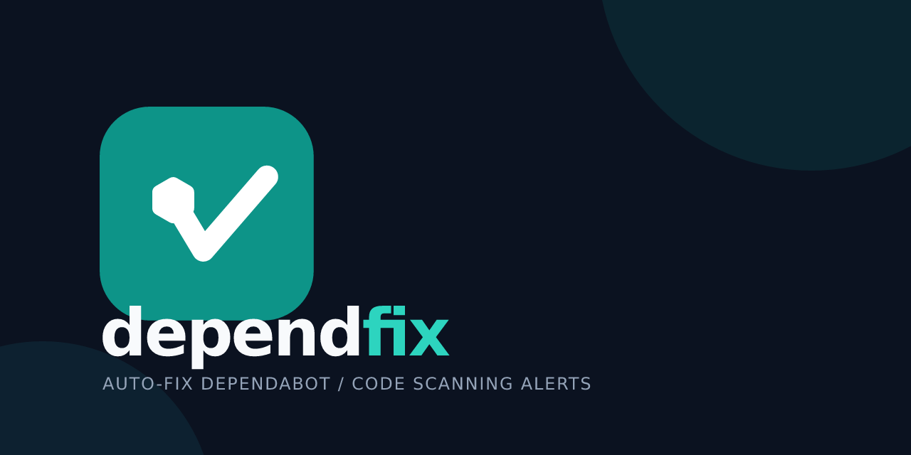

<p align="center">
  
</p>

<!-- i18n: switch -->
[简体中文](./README.md) | [English](./README.en-US.md)

# dependfix

> CLI tool for automated handling of GitHub Dependabot / Code Scanning security alerts.

## Installation

```bash
# Global install
pnpm add -g dependfix

# Or run directly (no install required)
npx dependfix report-only --repo owner/repo --github-token $GITHUB_TOKEN
```

## Commands

### `report-only` — View alerts (default)

Fetch alerts and generate Markdown + JSON dual-format reports, without modifying any files.

```bash
dependfix report-only --repo owner/repo --github-token $GITHUB_TOKEN
```

### `fix` — Fix alerts

Execute dependency upgrade, lockfile fix and verification (lint / build), modifications limited to local files, no branch or PR creation.

```bash
dependfix fix --repo owner/repo --github-token $GITHUB_TOKEN --severity-threshold high
```

### `fix-and-pr` — Fix and create PR

After executing the full fix flow, automatically create fix branch, commit, push and create Pull Request.

```bash
dependfix fix-and-pr --repo owner/repo --github-token $GITHUB_TOKEN
```

> Requires `GITHUB_TOKEN` with `contents: write` and `pull-requests: write` permissions.

## CLI flags

| Flag | Alias | Description | Default |
|:-----|:------|:------------|:--------|
| `mode` | (positional arg) | Run mode: `report-only` / `fix` / `fix-and-pr` | `report-only` |
| `--repo` | `-r`, `--repository`, `--repositories` | Target repo (`owner/repo`), comma-separated | — |
| `--repos-file` | — | Read repo list from file (one `owner/repo` per line) | — |
| `--github-token` | — | GitHub Personal Access Token | `GITHUB_TOKEN` env var |
| `--severity-threshold` | — | Severity: `critical` / `high` / `medium` / `all` | `high` |
| `--dry-run` | — | Dry-run mode, do not actually write files | `false` |
| `--create-pr` | — | Create Pull Request (auto-enabled in `fix-and-pr` mode) | `false` |
| `--commit` | — | After fix, commit on local current branch (`fix` mode only; no push, no PR) | `false` |
| `--max-alerts-per-repository` | — | Max alerts processed per repo | `20` |
| `--commands` | — | Custom verification commands (comma-separated), override default `install/lint/build` | — |
| `--verbose` | — | Verbose logging | `false` |

### Environment variables

| Env var | Description |
|:--------|:------------|
| `GITHUB_TOKEN` | GitHub auth token |

## Programmatic usage

```ts
import { DependfixApp, runCli } from 'dependfix'

// Parse CLI args
const { config } = runCli(process.argv.slice(2))

// Programmatic execution
const app = new DependfixApp({ config, verbose: true })
const { result, exitCode } = await app.run()
```

## Fix flow

1. **Fetch alerts** — get Dependabot alerts via GitHub API
2. **Filter and sort** — filter by severity, sort by priority, limit count
3. **Upgrade dependencies** — `pnpm update <package>` to recommended version
4. **Lockfile fix** — detect and fix `pnpm frozen-lockfile` issues
5. **Verify** — execute `pnpm install --frozen-lockfile` → `pnpm lint` → `pnpm build`
6. **Branch and PR** — in `fix-and-pr` mode, create branch, commit, push, PR

## Related packages

- [dependfix main project](https://github.com/dependfix/dependfix) — this package's source and full docs
- [@dependfix/core](https://github.com/dependfix/dependfix/blob/master/packages/core/README.md) — core domain model library (this package depends on)
- [@dependfix/engine](https://github.com/dependfix/dependfix/blob/master/packages/engine/README.md) — execution engine (this package depends on)
- [@dependfix/skills](https://github.com/dependfix/dependfix/blob/master/packages/skills/README.md) — Agent Skill source of truth (this package depends on)
- [@dependfix/mcp](https://github.com/dependfix/dependfix/blob/master/packages/mcp/README.md) — MCP Server (AI assistant usage form)